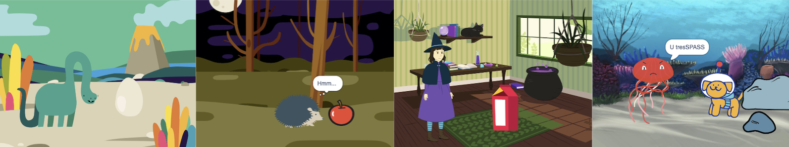
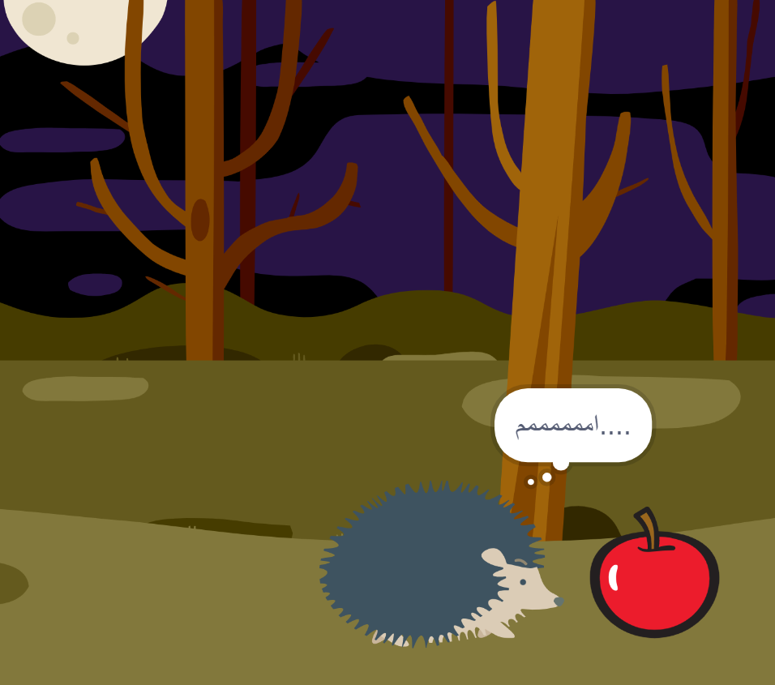

## سوف تصنع

قم بإنشاء رسوم متحركة قصيرة مع مفاجأة.

سوف تقوم بما يلي:

+ قم بإنشاء الرسوم المتحركة الخاصة بك
+ اختبار وتصحيح التعليمات البرمجية الخاصة بك عند إجراء التغييرات
+ قم ببناء الرسوم المتحركة الخاصة بك جزءًا واحدًا في كل مرة

--- no-print ---

--- task ---

  

### جربها 

انقر فوق العلم الأخضر لمشاهدة الرسوم المتحركة.

تتكون الرسوم المتحركة من أربع أجزاء:
+ إعداد
+ فضول
+ مفاجأة!
+ رد الفعل

**Dinosaur surprise!**: [See inside](https://scratch.mit.edu/projects/495932563/editor){:target="_blank"}

  <iframe allowtransparency="true" width="485" height="402" src="https://scratch.mit.edu/projects/embed/495932563/?autostart=false" frameborder="0"></iframe>

--- /task ---

### احصل على أفكار 💭

--- task ---

استكشف هذه الأمثلة على المشاريع للحصول على أفكار لكتابك. فكر في ماهية قصتك ، واستكشف هذه الأمثلة من المشاريع للحصول على مزيد من الأفكار:

⭐ شارك مشروع الرسوم المتحركة المفاجئ الخاص بك للحصول على فرصة عرضه هنا.

**BOO!**: [See inside](https://scratch.mit.edu/projects/498655116/editor){:target="_blank"}

  <iframe allowtransparency="true" width="485" height="402" src="https://scratch.mit.edu/projects/embed/498655116/?autostart=false" frameborder="0"></iframe>

**Cat magic**: [See inside](https://scratch.mit.edu/projects/498615133/editor){:target="_blank"}

  <iframe allowtransparency="true" width="485" height="402" src="https://scratch.mit.edu/projects/embed/498615133/?autostart=false" frameborder="0"></iframe>

**⭐ Jumpscare!**: [See inside](https://scratch.mit.edu/projects/720220722/editor){:target="_blank"} (featured community project)

  <iframe allowtransparency="true" width="485" height="402" src="https://scratch.mit.edu/projects/embed/720220722/?autostart=false" frameborder="0"></iframe>

--- /task ---

--- /no-print ---

--- print-only ---

### احصل على أفكار 💭

ستتخذ قرارات التصميم وتفكر في قصة للرسوم المتحركة الخاصة بك مع المفاجأة. فكر في ما يمكن أن تكون عليه قصتك ، وللحصول على مزيد من الأفكار ، **انظر داخل** مثال على المشاريع في "مفاجأة! الرسوم المتحركة - أمثلة في استوديو سكراتش: https://scratch.mit.edu/studios/29075822/

تتكون الرسوم المتحركة من أربع أجزاء:
+ فضول
+ مفاجئة!
+ رد الفعل

 

--- /print-only ---

 
