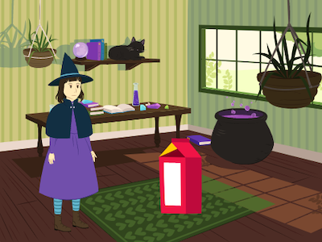

## المقدمة

قم بإنشاء رسوم متحركة قصيرة مع مفاجأة.

سوف تقوم بما يلي:

+ استخدم سكراتش لإنشاء رسم متحرك
+ اختبار وتصحيح التعليمات البرمجية الخاصة بك عند إجراء التغييرات
+ قسِّم الرسم المتحرك إلى أجزاء - وهذا ما يسمى **التفكيك** - وقم ببنائه جزءًا واحدًا في كل مرة

  **التفكيك** هو تقسيم المشروع إلى أجزاء أصغر وأسهل في الفهم. هذا يعني أنه يمكنك بناء مشروع. جزء واحد في كل مرة حتى تكمله. 

--- no-print ---

--- task ---

  

### جربها 

انقر فوق العلم الأخضر لمشاهدة الرسوم المتحركة.

تتكون الرسوم المتحركة من أربعة أجزاء:
+ إعداد
+ فضول
+ مفاجأة!
+ رد الفعل

**مفاجأة الديناصور!**: [راجع الداخل](https://scratch.mit.edu/projects/603371715/editor){:target="_blank"}

  <iframe allowtransparency="true" width="485" height="402" src="https://scratch.mit.edu/projects/embed/603371715/?autostart=false" frameborder="0"></iframe>

--- /task ---

### احصل على الإلهام

--- task ---

ستتخذ قرارات التصميم وتفكر في قصة للرسوم المتحركة الخاصة بك مع المفاجأة.

فكر في ماهية قصتك ، واستكشف هذه الأمثلة من المشاريع للحصول على مزيد من الأفكار:

**بوو!**: [انظر من الداخل](https://scratch.mit.edu/projects/603371109/editor){:target="_blank"}

  <iframe allowtransparency="true" width="485" height="402" src="https://scratch.mit.edu/projects/embed/603371109/?autostart=false" frameborder="0"></iframe>

**سحر القطط**: [انظر الداخل](https://scratch.mit.edu/projects/603371472/editor){:target="_blank"}

  <iframe allowtransparency="true" width="485" height="402" src="https://scratch.mit.edu/projects/embed/603371472/?autostart=false" frameborder="0"></iframe>

**المتعدي**: [انظر الداخل](https://scratch.mit.edu/projects/603372441/editor){:target="_blank"}

  <iframe allowtransparency="true" width="485" height="402" src="https://scratch.mit.edu/projects/embed/603372441/?autostart=false" frameborder="0"></iframe>

--- /task ---

--- /no-print ---

--- print-only ---

### احصل على الإلهام

ستتخذ قرارات التصميم وتفكر في قصة للرسوم المتحركة الخاصة بك مع المفاجأة. فكر في ما يمكن أن تكون عليه قصتك ، وللحصول على مزيد من الأفكار ، **انظر داخل** مثال على المشاريع في "مفاجأة! الرسوم المتحركة - أمثلة في استوديو سكراتش: https://scratch.mit.edu/studios/29075822/

تتكون الرسوم المتحركة من أربعة أجزاء:
+ نظام
+ فضول
+ مفاجئة!
+ رد الفعل

   

--- /print-only ---

هناك أشخاص يُطلق عليهم **مصممو السرد** يقومون بسرد القصص للتطبيقات وألعاب الفيديو. لكن رواية القصص الرقمية تتيح للجميع مشاركة قصصهم وتصوراتهم الإبداعية مع أشخاص آخرين.

 
