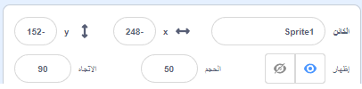
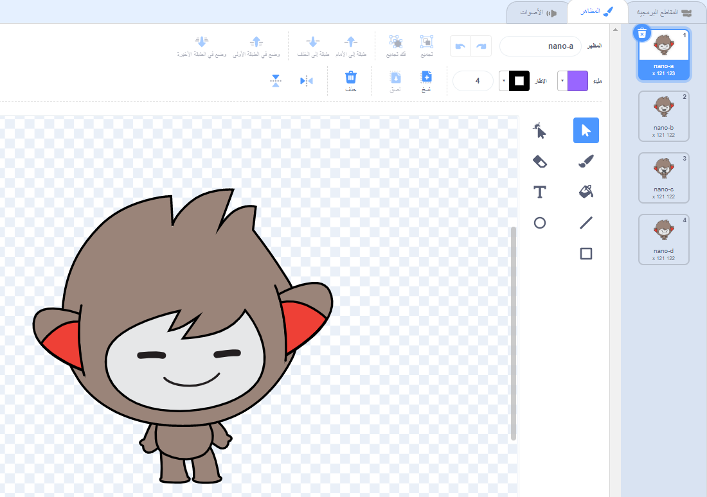
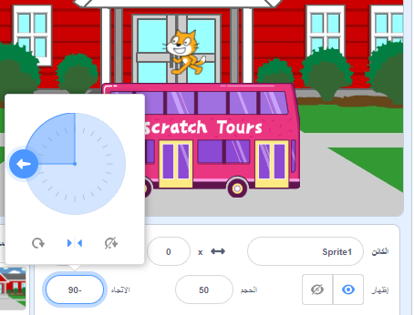

## نظام

<div style="display: flex; flex-wrap: wrap">
<div style="flex-basis: 200px; flex-grow: 1; margin-right: 15px;">
هل لديك فكرة عن الرسوم المتحركة الخاصة بك؟ 
  
في هذه الخطوة ، ستضيف خلفية وشخصية رئيسية وكائنًا مثيرًا للاهتمام. 
</div>
<div>  
! ["مفاجأة الديناصورات!" تم إعداد المشروع مرة واحدة.] (images / dinosaur-surprise.png)
</div>
</div>

--- task ---

افتح مفاجأة [! افتح ](https://scratch.mit.edu/projects/582222532/editor)مشروع Scratch جديد{: target = "_ blank"} وانظر إلى مجموعة الكائنات والخلفيات التي يمكنك استخدامها. اقض بعض الوقت في التفكير في شخصيتك الرئيسية ، والشيء المثير للاهتمام فيها ، والخلفية.

--- /task ---

--- task ---

**اختر:** اختر كائنًا ليكون الشخصية الرئيسية وكائنًا آخر ليكون الكائن المثير للاهتمام.


--- /task ---

أين تريد أن يكون موقع الكائن الخاص بك؟

--- task ---

**اختر:** اختر خلفية لضبط المشهد.


--- /task ---

من أين تريد أن يبدأ الكائن الخاص بك؟ ما هو الحجم الذي تريده أن يكون؟ كيف تريدهم أن يبدوا؟

--- task ---

أضف `عندما ينقر على العلم الأخضر `{: class = "block3events"} ، ثم أضف كتلًا أسفلها لإعداد الكائنات في بداية الرسم المتحرك.

تذكر أن تقوم بإعداد كل من الشخصية **** و **الكائنك المثير للاهتمام**.

--- collapse ---
---
العنوان: موقع الكائنات الخاصة بك
---

لتغيير موضع **للشخصية الرئيسية** للمشروع بأكمله ، انقل الشخصية الرئيسية إلى الموضع الذي تختاره على المنصة.

لتغيير موضع ** الكائن الرئيسي** في جزء من المشروع ، انقل الشخصية الرئيسية إلى الموضع الذي تختاره على المنصة ، ثم أضف ` كتلة انتقل إلى x: y:`{: class = "block3motion"} إلى التعليمات البرمجية الخاصة بك:

```blocks3
go to x: (0) y: (0) // add the sprite's position
```

كرر هذه المهمة لـ **كائنك مثير للاهتمام**.

--- /collapse ---

--- collapse ---
---
العنوان: قم بتغيير حجم الكائنات الخاصة بك
---

لتغيير حجم كائن للمشروع بأكمله ، قم بتغيير الرقم في **الحجم** في جزء خصائص الكائن:



لتغيير حجم كائن لجزء من المشروع ، أضف رمزًا إلى `ضبط الحجم إلى`{: class = "block3looks"} الحجم الذي تختاره. هذا الخيار جيد إذا كنت تريد أن يغير الكائن الخاص بك حجمه في المشروع.

```blocks3
set size to [100] % // <100 is smaller, >100 is bigger
```

--- /collapse ---

--- collapse ---
---
العنوان: اضبط أزياء الكائنات
---

لتغيير مظهر كائن للمشروع بأكمله ، انقر فوق **الأزياء** وحدد أحد الأزياء المتاحة:



لتغيير مظهر كائن لجزء من المشروع ، أضف تبديل زي ``{: class = "block3looks"} إلى التعليمات البرمجية الخاصة بك وقم بتحديثه لإظهار الزي الذي تختاره:

```blocks3
switch costume to [ v]  // update this for your chosen costume
```

لإخفاء كائن في بداية المشروع ، أضف `إخفاء`{: class = "block3looks"} إلى التعليمات البرمجية الخاصة بك:

```blocks3
hide 
```

--- /collapse ---

--- collapse ---
---
العنوان: اضبط أتجاه الكائنات الخاصة بك
---

قد يكون اتجاه الكائنات خاطئ عند إضافتها إلى مشروعك.

لتغيير اتجاه الكائن للمشروع بأكمله، تغيير **اتجاه** و **أسلوب التدوير** من خصائص الكائن:



لتغيير اتجاه كائن لجزء من المشروع ، أضف كتلًا إلى الكود الخاص بك لتغيير نمط التدوير ``{: class = "block3motion"} والاتجاه ``{: class = "block3motion"}:

```blocks3
set rotation style [left-right v]
point in direction (-90) // turn to the left
```

--- /collapse ---

--- /task ---

--- task ---

احفظ مشروعك.

[[[generic-scratch3-saving]]]

--- /task ---

--- save ---
