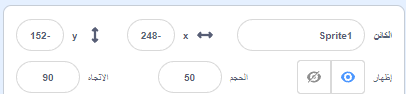
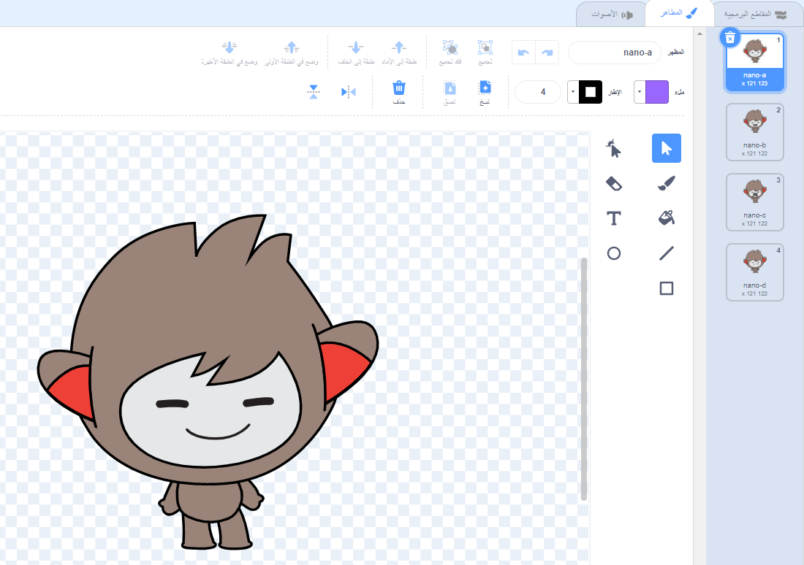
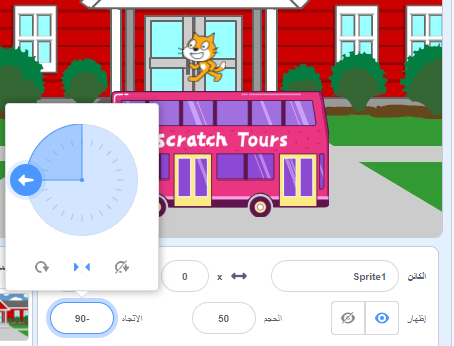

## اصنع مشهدك

هل لديك فكرة عن الرسوم المتحركة الخاصة بك؟ في هذه الخطوة ، ستضيف خلفية وشخصية رئيسية وكائنًا مثيرًا للاهتمام.

أضف خلفية 🖼️، وشخصية رئيسية 🐙👩‍🦼🦖، وكائنًا مثيرًا للاهتمام 🎂🎾🎁 من اختيارك لإنشاء الجزء **الأول** من الرسوم المتحركة الخاصة بك.


<p style="border-left: solid; border-width:10px; border-color: #0faeb0; background-color: aliceblue; padding: 10px;">
  <span style="color: #0faeb0">رسوم متحركة</span>  اصنع تأثير الحركة عن طريق تغيير الصور بسرعة. قام الرسامون الأوائل بنحت الصور من كتل خشبية واستخدامها كطوابع. من الأسرع بكثير استخدام سكراتش لترميز الرسوم المتحركة الخاصة بك!
</p>

### افتح مشروع البداية

--- task ---

افتح [مفاجأة! مشروع بداية الرسوم المتحركة](https://scratch.mit.edu/projects/582222532/editor){:target="_blank"}.

⏱️ ليس الكثير من الوقت؟ يمكنك البدء من أحد [الأمثلة ](https://scratch.mit.edu/studios/29075822) {:target="_blank"}.

--- /task ---

<p style="border-left: solid; border-width:10px; border-color: #0faeb0; background-color: aliceblue; padding: 10px;">
هناك أشخاص يُطلق عليهم <span style="color: #0faeb0">** مصممو السرد **</span> يقومون بسرد القصص للتطبيقات وألعاب الفيديو. تتيح رواية القصص الرقمية للجميع مشاركة قصصهم وتصوراتهم الإبداعية مع أشخاص آخرين.
</p>

### صمم المشهد الخاص بك

--- task ---

**اختر:** موضوعًا للرسوم المتحركة الخاصة بك. يمكنك الاختيار:

+ 🐯 الحيوانات البرية
+ 🐠 حيوانات بحرية
+ 👽 كائنات فضائية
+ 🌿 الطبيعة
+ 🌈 الطقس
+ 🌮 الطعام
+ 🚀 السفر
+ ⚾ رياضة .... أو شيء آخر

--- /task ---

--- task ---

**اختر:** اختر كائنًا ليكون 🐙👩‍🦼🦖 **الشخصية الرئيسية**، وكائنًا آخر ليكون 🎂🎾🎁 **كائنًا مثيرًا للاهتمام** و🖼️ **خلفية** لضبط المشهد.


--- /task ---

### تحضير الكائنات الخاصة بك

من أين تريد أن يبدأ الكائن الخاص بك؟ ما هو الحجم الذي تريده أن يكون؟ كيف تريدهم أن يبدووا؟

--- task ---

أضف `عندما ينقر على العلم الأخضر`{:class="block3events"} ، ثم أضف كتلًا أسفلها لإعداد الكائنات في بداية الرسم المتحرك.

كرر هذه المهمة لـ **كائنك مثير للاهتمام**.

--- collapse ---
---
title: موقع الكائنات الخاصة بك
---

انقل الشخصية الرئيسية 🐙👩‍🦼🦖 **** إلى الموضع الذي تختاره على المسرح، ثم أضف الكتلة `go to x: y:`{:class="block3motion"} إلى الكود الخاص بك:

```blocks3
go to x: (0) y: (0) // add the sprite's position
```

تذكر أن تقوم بإعداد كل من الشخصية **** و**الكائنك المثير للاهتمام**.

--- /collapse ---

--- collapse ---
---
title: قم بتغيير حجم الكائنات الخاصة بك
---

لتغيير حجم كائن للمشروع بأكمله ، قم بتغيير الرقم في **الحجم** في جزء خصائص الكائن:



لتغيير حجم كائن لجزء من المشروع ، أضف رمزًا إلى `ضبط الحجم إلى`{:class="block3looks"} الحجم الذي تختاره. هذا الخيار جيد إذا كنت تريد أن يغير الكائن الخاص بك حجمه في المشروع.

```blocks3
set size to [100] % // <100 is smaller, >100 is bigger
```

--- /collapse ---

--- collapse ---
---
title: اضبط أزياء الكائنات
---

لتغيير مظهر كائن للمشروع بأكمله ، انقر فوق **الأزياء** وحدد أحد الأزياء المتاحة:



لتغيير مظهر كائن لجزء من المشروع ، أضف `تبديل زي`{:class="block3looks"} إلى التعليمات البرمجية الخاصة بك وقم بتحديثه لإظهار الزي الذي تختاره:

```blocks3
switch costume to [ v]  // update this for your chosen costume
```

لإخفاء كائن في بداية المشروع ، أضف `إخفاء`{:class="block3looks"} إلى التعليمات البرمجية الخاصة بك:

```blocks3
hide 
```

--- /collapse ---

--- collapse ---
---
title: اضبط أتجاه الكائنات الخاصة بك
---

قد يكون اتجاه الكائنات خاطئ عند إضافتها إلى مشروعك.

لتغيير اتجاه الكائن للمشروع بأكمله، تغيير **اتجاه** و **أسلوب التدوير** من خصائص الكائن:



لتغيير اتجاه كائن لجزء من المشروع ، أضف كتلًا إلى الكود الخاص بك لتغيير `نمط التدوير`{:class="block3motion"} `والاتجاه`{:class="block3motion"}:

```blocks3
set rotation style [left-right v]
point in direction (-90) // turn to the left
```

--- /collapse ---

--- /task ---

--- task ---

احفظ مشروعك.

[[[generic-scratch3-saving]]]

--- /task ---
