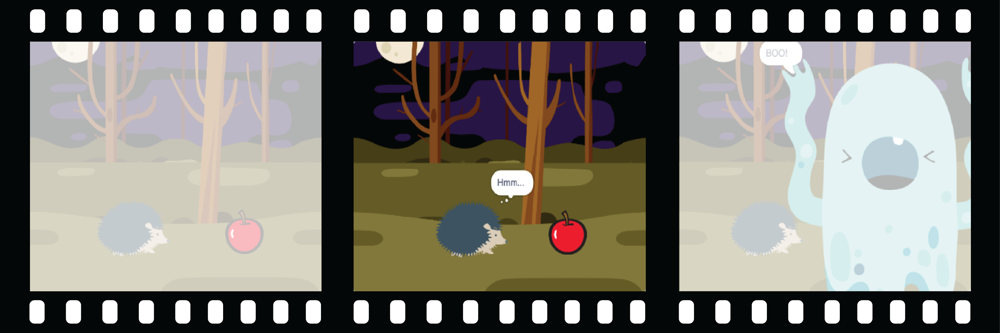

## أظهر الفضول

هل سيفعل الكائن شيئًا لجذب الانتباه؟ كيف سيكون رد فعل الكائن؟ انت صاحب القرار! كيف سيكون رد فعل الكائن؟ انت صاحب القرار! قم بإنشاء الجزء **الثاني** من الرسوم المتحركة الخاصة بك.



<p style="border-left: solid; border-width:10px; border-color: #0faeb0; background-color: aliceblue; padding: 10px;">
  <span style="color: #0faeb0">** التفكيك **</span> هو تقسيم المشروع إلى أجزاء أصغر وأسهل في الفهم. هذا يعني أنه يمكنك بناء مشروع. جزء واحد في كل مرة حتى تكمله. في هذه الخطوة سوف تركز فقط على الجزء الفضولي من الرسوم المتحركة الخاصة بك.
</p>

### الكائن

--- task ---

**اختر:** إذا كنت تريد أن يقوم الكائن بشيء ما ، فاختر ما سيفعله الكائن.


أضف كتلًا إلى نهاية الكائن `عند النقر على العلم الأخضر`{:class="block3events"} لضبط التعليمات البرمجية.

[[[scratch3-jiggle-a-sprite]]]

[[[scratch3-graphic-effects]]]

--- /task ---

### الشخصية

--- task ---

احصل على الشخصية الرئيسية لإظهار الاهتمام بالكائن. أضف الكتل إلى نهاية لضبط التعليمة البرمجية **الخاص بـ**.

إذا كنت في حاجة إلى أنتظار شخصية ما لعمل شيء لديه، إضف كتلة `الانتظار`{:class="block3control"}.


يمكنك استخدام كتلة `قول`{:class="block3looks"} أو كتلة `فكر`{:class="block3looks"} ، أو حتى استخدام `نص إلى كلام`{:class="block3extensions"} لجعل الشخصية تتحدث بصوت عال!

[[[scratch3-text-to-speech]]]

يمكن للشخصية أن ترمز ، كما هو الحال في مشروع [حديث الفضاء](https://projects.raspberrypi.org/ar-SA/projects/space-talk){:target="_blank"}.

[[[scratch3-change-costumes-to-show-mood]]]

يمكن أن تكون الشخصية شجاعة وتقترب أكثر للتحقق من الكائن.

[[[scratch3-animate-movement-costumes]]]

--- /task ---

--- task ---

**اختبار:** انقر فوق العلم الأخضر لاختبار مشروعك. يجب أن تظهر الشخصية فضولًا حول الكائن.

انقر على العلم الأخضر مرة أخرى. إذا قمت بتغيير موضع الكائن **** أو**الشخصية ** أو شكله ، فستحتاج إلى التأكد من أنه تم إعادته إلى موضع البداية أو المظهر عند تشغيل المشروع مرة أخرى.

--- collapse ---
---
title: Set the starting position and looks for a sprite
---

اختر الكتل التي تحتاجها لتعيين الموضع وابحث عن الكائن في البداية.

```blocks3
when flag clicked // add blocks to set up the start 
switch costume to [costume1 v]
set size to (100) % // starting size
go to x: (-200) y: (50) // starting position
point in direction [90]
set [brightness v] effect to [80]
show
```

**نصيحة:** يتم مسح جميع تأثيرات الرسوم عند النقر فوق العلم الأخضر ، لذلك لا تحتاج إلى مسحها ، ولكن قد تحتاج إلى تعيين التأثيرات التي تريد أن يكون للكائن المتحرك.

--- /collapse ---

--- /task ---

--- task ---

**التصحيح:**

--- collapse ---
---
title: The sound is not working
---

تأكد من أن مستوى الصوت على الكمبيوتر أو الجهاز اللوحي مرتفع بدرجة كافية وأن مكبرات الصوت أو سماعات الرأس متصلة وتعمل بشكل صحيح.

--- /collapse ---

--- collapse ---
---
title: My animation does not reset properly when I click on the green flag
---

تحقق من أن مشروعك يحتوي على `عند نقر على العلم الأخضر`{:class="block3events"} نصوص برمجية للكائنات التي تحتاجها ، وتحقق من أنها تعيد تعيين الموضع والحجم والبحث عن الكائنات. للمساعدة في هذا ، راجع **تعيين موضع البداية والبحث عن** أعلاه.

--- /collapse ---

--- /task ---

