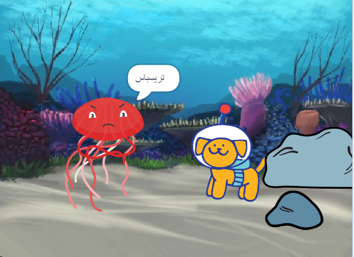

## رد الفعل

الآن ، يجب أن تتفاعل الشخصية الرئيسية مع المفاجأة. ماذا سيفعلون؟ 
- متى سيتفاعلون؟
- كيف سيقومون بالتعبير؟ 
- هل سيقولون شيئًا ، أو يصدرون صوتًا ، أو يغيرون الأزياء ، أو يتحركون؟ 

انت صاحب القرار!

### متى ستتفاعل الشخصية؟

--- task ---

حدد شخصية **** الكائن. أضف تعليمة برمجية لبدء المفاجأة عندما تريد ذلك.

[[[scratch3-time-delay]]]

--- /task ---

### كيف سيكون رد فعل الكائن؟

--- task ---

اختر الإفعال التي تناسب شخصيتك وردة فعلها.

[[[scratch3-change-costumes-to-show-mood]]]

[[[scratch3-graphic-effects]]]

[[[scratch3-text-to-speech]]]

[[[scratch3-animate-movement-costumes]]]

[[[scratch3-add-sound]]]

[[[scratch3-record-sound]]]

--- /task ---

--- task ---

**اختبار:** انقر فوق العلم الأخضر. هل تسلسل الاحداث الخاصة بك كما تريدها؟ هل خلقت تشويقًا وردة فعل في قصتك؟ هل تتم إعادة ضبط كل شيء بشكل صحيح عند النقر فوق العلم الأخضر مرة أخرى؟

--- /task ---

--- task ---

**تصحيح:** قد تحتاج إلى تغيير مقدار الوقت في بعض أو كل الكتل `عند المؤقت`{:class="block3events"} و `انتظار`{:class="block3control"} ،أو إضافة المزيد من الكتل `انتظار`{:class="block3control"} ، للحصول على التوقيت المناسب تمامًا.

--- /task ---

--- save ---
