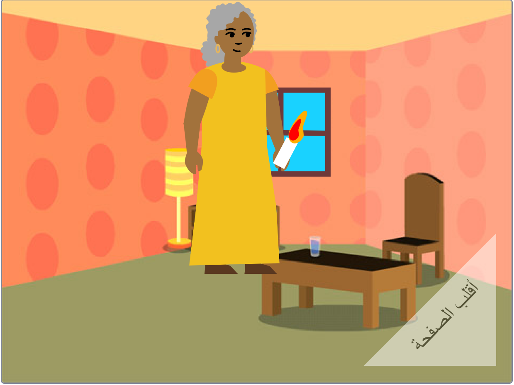

## ماذا بعد؟

إذا كنت تتبع [مقدمة إلى](https://projects.raspberrypi.org/ar-SA/pathway/scratch-intro) ، يمكنك الانتقال إلى مشروع [لقد صنعت لك كتاب](https://projects.raspberrypi.org/ar-SA/projects/i-made-you-a-book). في هذا المشروع ، ستؤلف كتابًا بلغة سكراتش بناءً على فكرتك الخاصة.

--- no-print ---

**إضاءة الطريق إلى المنزل**: [انظر من الداخل](https://scratch.mit.edu/projects/499860786/editor){:target="_blank"}

  <iframe allowtransparency="true" width="485" height="402" src="https://scratch.mit.edu/projects/embed/499860786/?autostart=false" frameborder="0"></iframe>

--- /no-print ---

--- print-only ---

--- /print-only ---

إذا كنت ترغب في الحصول على مزيد من المتعة في استكشاف Scratch ، فيمكنك تجربة أي من [هذه المشاريع](https://projects.raspberrypi.org/ar-SA/projects?software%5B%5D=scratch&curriculum%5B%5D=%201).

***
تمت ترجمة هذا المشروع بواسطة متطوعين:

رائد موسى الجعفري
محمد حسين جبار

بفضل المتطوعين ، يمكننا إعطاء الناس في جميع أنحاء العالم فرصة للتعلم بلغتهم الخاصة. يمكنك مساعدتنا في الوصول إلى المزيد من الأشخاص من خلال التطوع للترجمة - مزيد من المعلومات على [rpf.io/translate](https://rpf.io/translate).
