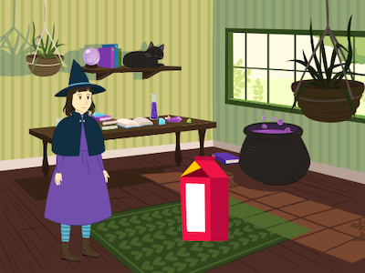

## Co budeš dělat

Vytvoříš krátkou animaci 🎥 se zábavným překvapením 🎉!

Budeš:

+ Vytvářet vlastní animaci
+ Testovat a ladit svůj kód
+ Sestavovat svou animaci jednu část po druhé

--- no-print ---

--- task ---

  

### Hrej ▶️ 

Kliknutím na zelenou vlajku spustíš animaci.

Animace má tři části:
+ Zvídavost
+ Překvapení!
+ Reakce

**Dinosaur surprise!**: [See inside](https://scratch.mit.edu/projects/495932563/editor){:target="_blank"}

  <iframe allowtransparency="true" width="485" height="402" src="https://scratch.mit.edu/projects/embed/495932563/?autostart=false" frameborder="0"></iframe>

--- /task ---

### Inspiruj se 💭

--- task ---

Pohraj si s těmito ukázkovými projekty, a inspiruj se. Popřemýšlej, o čem by tvoje animace mohla být, a prozkoumej tyto ukázkové projekty, abys získal další nápady:

⭐ Poděl se o svůj hotový animovaný projekt Překvapení, abys měl šanci, že zde bude uveden.

**BOO!**: [See inside](https://scratch.mit.edu/projects/498655116/editor){:target="_blank"}

  <iframe allowtransparency="true" width="485" height="402" src="https://scratch.mit.edu/projects/embed/498655116/?autostart=false" frameborder="0"></iframe>

**Cat magic**: [See inside](https://scratch.mit.edu/projects/498615133/editor){:target="_blank"}

  <iframe allowtransparency="true" width="485" height="402" src="https://scratch.mit.edu/projects/embed/498615133/?autostart=false" frameborder="0"></iframe>

**⭐ Jumpscare!**: [See inside](https://scratch.mit.edu/projects/720220722/editor){:target="_blank"} (featured community project)

  <iframe allowtransparency="true" width="485" height="402" src="https://scratch.mit.edu/projects/embed/720220722/?autostart=false" frameborder="0"></iframe>

--- /task ---

--- /no-print ---

--- print-only ---

### Inspiruj se 💭

Budeš navrhovat designu a vymyslíš příběh pro svou animaci s překvapením. Přemýšlej o tom, jaký by mohl být tvůj příběh, a chceš-li získat další nápady, **Podívej se** na příklad projektů v 'Překvapení! animace — Příklady' Scratch studio: https://scratch.mit.edu/studios/29075822/

Animace má tři části:
+ Zvídavost
+ Překvapení!
+ Reakce

 

--- /print-only ---

 
