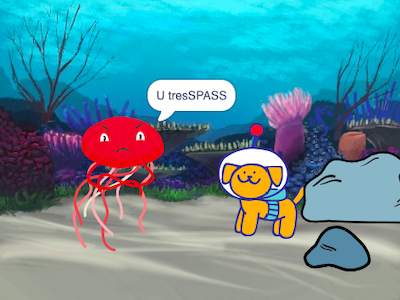

## Upgrade your project

You could upgrade your project by adding a reaction. How will your main character react? 

You decide!

--- task ---

What will they do? Will they say something, make a sound, change costumes, or move?

[[[scratch3-change-costumes-to-show-mood]]]

[[[scratch3-graphic-effects]]]

[[[scratch3-text-to-speech]]]

[[[scratch3-animate-movement-costumes]]]

[[[scratch3-add-sound]]]

[[[scratch3-record-sound]]]

--- /task ---

--- task ---

You could also:
+ Add to or improve your animation, with movement, looks, and graphic effects
+ Create or edit costumes in the Paint editor to make them look the way that you want
+ Record your voice or record sound effects and add the new sounds to your project

--- /task ---

Professional programmers explore and take inspiration from code created by other programmers. 

--- task ---

You can also look at the remixes for the [Surprise animation starter project](https://scratch.mit.edu/projects/582222532/remixes){:target="_blank"} to see what other creators have made.

--- /task ---

--- task ---

Each project in the ['Surprise! animation — Examples' Scratch studio](https://scratch.mit.edu/studios/29075822){:target="_blank"} has a **See inside** link, which you can use to open the project in the Scratch editor and look at the code to get ideas and see how the project works.

  <iframe allowtransparency="true" width="485" height="402" src="" frameborder="0"></iframe>

--- /task ---

--- task ---

Take a look at our ['Surprise! animation — Community' Scratch studio](https://scratch.mit.edu/studios/29079784){:target="_blank"} to see projects created by community members.

--- /task ---

