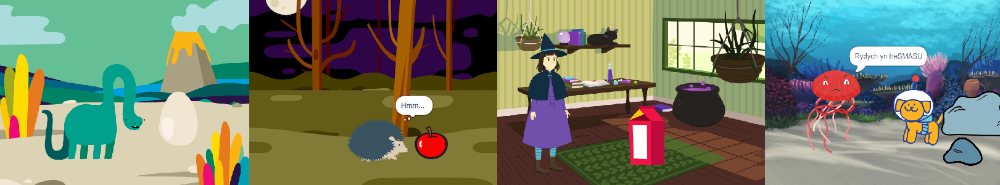

## Cyflwyniad

Creu animeiddiad byr gyda syrpreis.

Byddi di'n:

+ Defnyddio Scratch i greu animeiddiad
+ Profi a difa chwilod yn dy god wrth wneud newidiadau
+ Rhannu animeiddiad yn rhannau - proses sy'n cael ei alw'n **dadelfennu** - a'i adeiladu un rhan ar y tro

  **Dadelfennu** yw'r broses o rannu prosiect yn rhannau sy'n llai ac yn haws eu deall. Mae hyn yn golygu y galli di adeiladu prosiect un rhan ar y tro nes dy fod wedi'i gwblhau. 

--- no-print ---

--- task ---

  

### Rho gynnig arni

Clicia'r faner werdd i wylio'r animeiddiad.

Mae pedair rhan i'r animeiddiad:
+ Gosod
+ Chwilfrydedd
+ Syrpreis!
+ Ymateb

**Syrpreis dinasor!**: [Gweld tu mewn](https://scratch.mit.edu/projects/628367388/editor){:target="_blank"}

  <iframe allowtransparency="true" width="485" height="402" src="https://scratch.mit.edu/projects/embed/628367388/?autostart=false" frameborder="0"></iframe>

--- /task ---

### Cael ysbrydoliaeth

--- task ---

Byddi di'n gwneud penderfyniadau dylunio ac yn meddwl am stori ar gyfer dy animeiddiad sy'n cynnwys syrpreis.

Meddylia beth allai dy stori fod, a chymer olwg dros y prosiectau enghreifftiol hyn i gael mwy o syniadau:

**BOO!**: [Gweld tu mewn](https://scratch.mit.edu/projects/628364546/editor){:target="_blank"}

  <iframe allowtransparency="true" width="485" height="402" src="https://scratch.mit.edu/projects/embed/628364546/?autostart=false" frameborder="0"></iframe>

**Swyn y gath**: [Gweld tu mewn](https://scratch.mit.edu/projects/628366141/editor){:target="_blank"}

  <iframe allowtransparency="true" width="485" height="402" src="https://scratch.mit.edu/projects/embed/628366141/?autostart=false" frameborder="0"></iframe>

**Tresmaswr**: [Gweld tu mewn](https://scratch.mit.edu/projects/628368951/editor){:target="_blank"}

  <iframe allowtransparency="true" width="485" height="402" src="https://scratch.mit.edu/projects/embed/628368951/?autostart=false" frameborder="0"></iframe>

--- /task ---

--- /no-print ---

--- print-only ---

### Cael ysbrydoliaeth

Byddi di'n gwneud penderfyniadau dylunio ac yn meddwl am stori ar gyfer dy animeiddiad sy'n cynnwys syrpreis. Meddylia beth allai dy stori fod, ac i gael mwy o syniadau, **Cymer olwg y tu mewn i** brosiectau enghreifftiol yn stiwdio scratch 'Surprise! animation — Examples' https://scratch.mit.edu/studios/29075822/

Mae pedair rhan i'r animeiddiad:
+ Gosod
+ Chwilfrydedd
+ Syrpreis!
+ Ymateb

   

--- /print-only ---

Mae yna bobl o'r enw **dylunwyr naratif** sy'n datblygu'r straeon ar gyfer apiau a gemau fideo. Ond mae datblygu straeon digidol yn caniatáu i bawb rannu eu straeon a'u dychymyg creadigol â phobl eraill.

 
