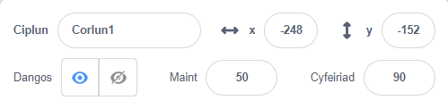
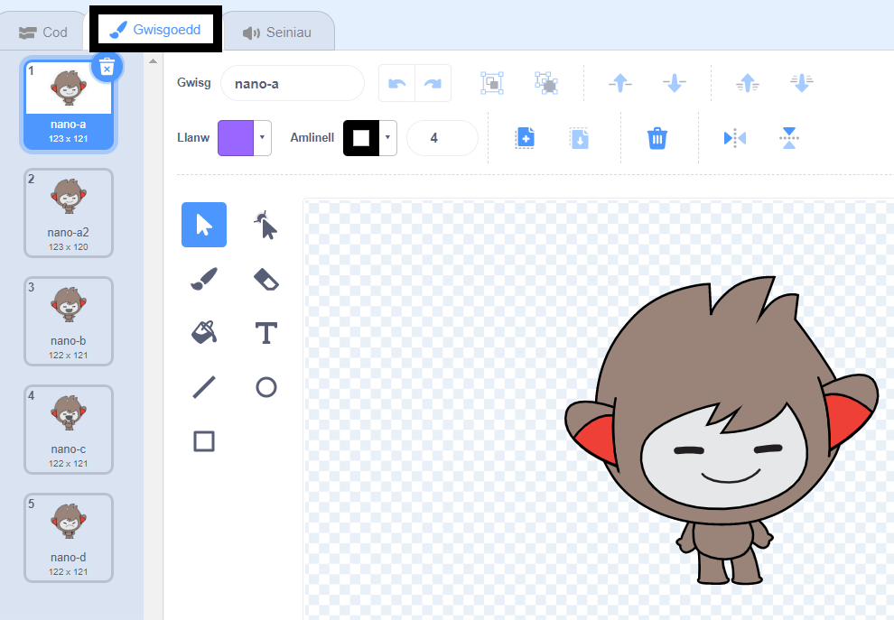
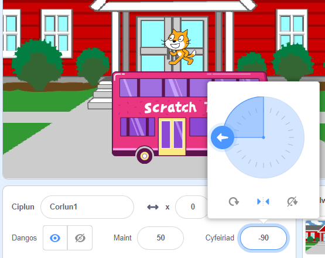

## Gosod

<div style="display: flex; flex-wrap: wrap">
<div style="flex-basis: 200px; flex-grow: 1; margin-right: 15px;">
Oes gen ti syniad ar gyfer dy animeiddiad? 
  
Yn y cam hwn, byddi di'n ychwanegu cefnlen, prif gymeriad, a gwrthrych diddorol. 
</div>
<div>  

</div>
</div>

--- task ---

Agora'r

prosiect cychwynnol animeiddio syrpreis!</0>{:target="_blank"} ac edrych ar yr holl gorluniau a chefnlenni y galli di eu defnyddio. Treulia ychydig o amser yn meddwl am dy brif gymeriad, gwrthrych diddorol, a chefndir.</p> 

--- /task ---

--- task ---

**Dewis:** Dewisa gorlun i fod y prif gymeriad a corlun arall i fod yn wrthrych diddorol.


--- /task ---

Ble wyt ti am i dy animeiddiad ddigwydd?

--- task ---

**Dewis:** Dewisa gefnlen i osod y cyd-destun. 


--- /task ---

Ble wyt ti am i dy gorluniau ddechrau? Pa mor fawr wyt ti am iddyn nhw fod? Sut wyt ti am iddyn nhw edrych?

--- task ---

Ychwanega floc `pan fydd y fflag werdd wedi'i chlicio`{:class="block3events"}, ac wedyn, oddi tano, ychwanega flociau i osod dy gorluniau ar ddechrau dy animeiddiad. 

Cofia osod dy **brif gymeriad** a dy **wrthrych diddorol**.

--- collapse ---
---
title: Gosod lleoliad dy gorluniau
---

I newid lleoliad y corlun **prif gymeriad** ar gyfer y prosiect cyfan, symuda'r prif gymeriad i'r safle o dy ddewis ar y Llwyfan. 

I newid safle dy gorlun **prif gymeriad** ar gyfer rhan o'r prosiect, symuda'r prif gymeriad i'r safle o dy ddewis ar y Llwyfan, ac wedyn ychwanegu bloc `mynd i x: y:`{:class="block3motion"} at dy god:


```blocks3
go to x: (0) y: (0) // ychwanega safle'r corlun
```


Gwna'r dasg hon eto ar gyfer y **gwrthrych diddorol**. 

--- /collapse ---

--- collapse ---
---
title: Newid maint dy gorluniau
---

I newid maint corlun ar gyfer y prosiect cyfan, newidia'r rhif yn y briodwedd **Maint** yng nghwarel y Corlun:



I newid maint corlun ar gyfer rhan o'r prosiect, ychwanega god i `osod y maint i`{:class="block3looks"} maint o dy ddewis. Mae'r opsiwn hwn yn dda os wyt ti am i dy gorlun newid ei faint yn y prosiect. 


```blocks3
set size to [100] % // mae <100 yn llai, mae >100 yn fwy
```


--- /collapse ---

--- collapse ---
---
title: Gosod gwisgoedd dy gorluniau
---

I newid gwisg corlun ar gyfer y prosiect cyfan, clicia ar y tab **Gwisgoedd** a dewis un o'r gwisgoedd sydd ar gael:



I newid gwisg corlun ar gyfer rhan o'r prosiect, ychwanega floc `newid gwisg i`{:class="block3looks"} i dy god a'i ddiweddaru i ddangos y wisg wnes di ei dewis:


```blocks3
switch costume to [ v]  // diweddaru hwn ar gyfer y wisg o dy ddewis
```


I guddio corlun ar ddechrau'r prosiect, ychwanega floc `cuddio`{:class="block3looks"} i dy god:


```blocks3
hide 
```


--- /collapse ---

--- collapse ---
---
title: Gosod cyfeiriad dy gorluniau
---

Efallai bydd dy gorluniau yn wynebu'r ffordd anghywir pan fyddi di'n eu hychwanegu at dy brosiect. 

I newid cyfeiriad corlun ar gyfer y prosiect cyfan, newidia'r **Cyfeiriad** a'r **steil cylchdroi** yng nghwarel Corlun:



I newid cyfeiriad corlun ar gyfer rhan o brosiect, ychwanega flociau i dy god er mwyn newid y `steil cylchdroi`{:class="block3motion"} a'r `cyfeiriad`{:class="block3motion"}:


```blocks3
set rotation style [left-right v]
point in direction (-90) // troi i'r chwith
```


--- /collapse ---

--- /task ---

--- task ---

Cadw dy brosiect.

[[[generic-scratch3-saving]]]

--- /task ---

--- save ---
