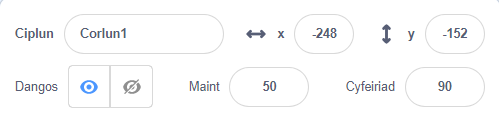
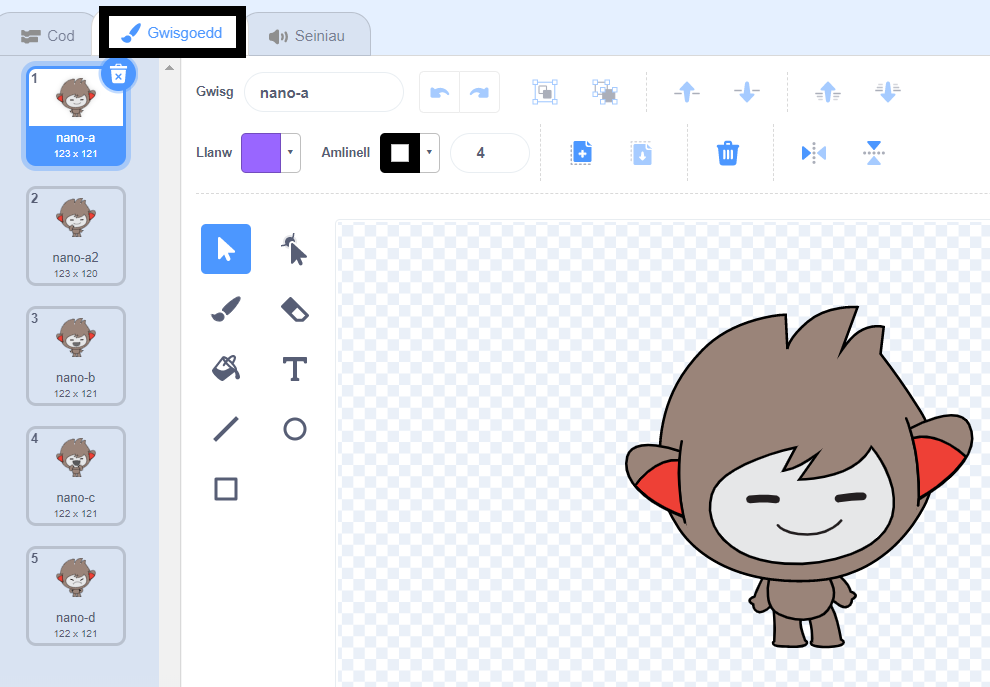
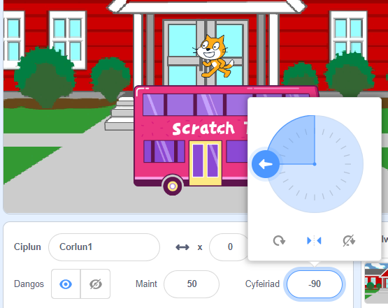

## Gosod

Have you got an idea about your animation?

Agora'r [prosiect cychwynnol animeiddio syrpreis!](https://scratch.mit.edu/projects/582222532/editor){:target="_blank"} ac edrych ar yr holl gorluniau a chefnlenni y galli di eu defnyddio. Treulia ychydig o amser yn meddwl am dy brif gymeriad, gwrthrych diddorol, a chefndir.


<p style="border-left: solid; border-width:10px; border-color: #0faeb0; background-color: aliceblue; padding: 10px;">
  <span style="color: #0faeb0">**Animation**</span> creates the effect of movement by changing pictures quickly. The first animators carved pictures out of wooden blocks and used them as stamps. It is much faster to use Scratch to code your animation!
</p>

### Open the starter project

--- task ---

Open the [Surprise! animation starter project](https://scratch.mit.edu/projects/582222532/editor){:target="_blank"}.

⏱️ Not much time? You can start from one of the [examples](https://scratch.mit.edu/studios/29075822){:target="_blank"}.

--- /task ---

<p style="border-left: solid; border-width:10px; border-color: #0faeb0; background-color: aliceblue; padding: 10px;">
There are people called <span style="color: #0faeb0">**narrative designers**</span> who do storytelling for apps and video games. Digital storytelling allows everyone to share their stories and creative imaginings with other people.
</p>

### Design your scene

--- task ---

**Choose:** a theme for your animation. You could choose:

+ 🐯 Land Animals
+ 🐠 Sea animals
+ 👽 Aliens
+ 🌿 Nature
+ 🌈 Weather
+ 🌮 Food
+ 🚀 Travel
+ ⚾ Sport .... Or something else

--- /task ---

--- task ---

**Choose:** Choose a sprite to be the 🐙👩‍🦼🦖 **main character**, another sprite to be the 🎂🎾🎁 **interesting object** and a 🖼️ **backdrop** to set the scene.


--- /task ---

### Prepare your sprites

Where do you want your sprites to start? How big do you want them to be? How do you want them to look?

--- task ---

I newid safle dy gorlun **prif gymeriad** ar gyfer rhan o'r prosiect, symuda'r prif gymeriad i'r safle o dy ddewis ar y Llwyfan, ac wedyn ychwanegu bloc `mynd i x: y:`{:class="block3motion"} at dy god:

Gwna'r dasg hon eto ar gyfer y **gwrthrych diddorol**.

--- collapse ---
---
title: Position your sprites
---

Move the 🐙👩‍🦼🦖 **main character** to the position of your choice on the Stage, then add a `go to x: y:`{:class="block3motion"} block to your code:

```blocks3
go to x: (0) y: (0) // add the sprite's position
```

I newid maint corlun ar gyfer y prosiect cyfan, newidia'r rhif yn y briodwedd **Maint** yng nghwarel y Corlun:

--- /collapse ---

--- collapse ---
---
title: Resize your sprites
---

To change the size of a sprite for the whole project, change the number in the **Size** property in the Sprite pane:



To change the size of a sprite for part of the project, add code to `set size to`{:class="block3looks"} the size of your choice. This option is good if you want your sprite to change size in the project.

```blocks3
set size to [100] % // <100 is smaller, >100 is bigger
```

--- /collapse ---

--- collapse ---
---
title: Set the costumes of your sprites
---

I guddio corlun ar ddechrau'r prosiect, ychwanega floc `cuddio`{:class="block3looks"} i dy god:



To change the costume of a sprite for part of the project, add a `switch costume to`{:class="block3looks"} block to your code and update it to show the costume of your choice:

```blocks3
switch costume to [ v]  // update this for your chosen costume
```

Efallai bydd dy gorluniau yn wynebu'r ffordd anghywir pan fyddi di'n eu hychwanegu at dy brosiect.

```blocks3
hide 
```

--- /collapse ---

--- collapse ---
---
title: Set the direction of your sprites
---

I newid cyfeiriad corlun ar gyfer rhan o brosiect, ychwanega flociau i dy god er mwyn newid y `steil cylchdroi`{:class="block3motion"} a'r `cyfeiriad`{:class="block3motion"}:

To change the direction of a sprite for the whole project, change the **Direction** and **rotation style** in the Sprite pane:



To change the direction of a sprite for part of the project, add blocks to your code to change the `rotation style`{:class="block3motion"} and `direction`{:class="block3motion"}:

```blocks3
set rotation style [left-right v]
point in direction (-90) // turn to the left
```

--- /collapse ---

--- /task ---

--- task ---

--- save ---

[[[generic-scratch3-saving]]]

--- /task ---
