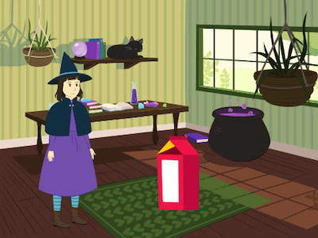

## Syrpreis

<div style="display: flex; flex-wrap: wrap">
<div style="flex-basis: 200px; flex-grow: 1; margin-right: 15px;">
Nawr, mae angen i ti ychwanegu syrpréis. Beth allai ddigwydd i'r gwrthrych? 
- A fydd yn troi'n wrthrych arall? 
- A fydd yn troi'n gymeriad? 
- A fydd yn diflannu ac yn datgelu corlun arall? 

Ti sy'n penderfynu!
</div>
<div>



</div>
</div>

<p style="border-left: solid; border-width:10px; border-color: #0faeb0; background-color: aliceblue; padding: 10px;">
Wyt ti wedi ysgrifennu stori gyda thro yn y plot neu syrpréis? Wyt ti wedi gwylio rhaglen deledu neu ddarllen llyfr gyda diweddglo anrhagweladwy? Galli di ddefnyddio'r un dulliau wrth greu stori ddigidol neu animeiddiad. 
</p>

### Pryd bydd y syrpreis yn digwydd?

--- task ---

Dewisa'r corlun **gwrthrych**. Ychwanega sgript i wneud i'r syrpreis ddechrau pan rwyt ti am iddo wneud hynny.

Bydd angen i ti ddewis amser oedi sy'n gweithio i dy brosiect. Os oes gen ti gymeriad sy'n treulio amser hir yn bod yn chwilfrydig, bydd angen i ti ddewis amser oedi hirach.

[[[scratch3-time-delay]]]

--- /task ---

### Nawr mae angen creu'r syrpreis!

--- task ---

Gallai'r gwrthrych `chwarae sain`{:class="block3sound"}, `newid gwisg`{:class="block3looks"}, `newid effeithiau graffeg`{:class="block3looks"}, neu `newid maint`{:class="block3looks"}.

Fe allet ti ychwanegu gwisg annisgwyl i'r corlun, yna gallai'r corlun `newid gwisg`{:class="block3looks"} i'w datgelu. Er enghraifft, fel allet ti wneud i'r **Afal** droi yn **Ysbryd**.

[[[scratch3-add-costumes-to-a-sprite]]]

Fe allet ti wneud i'r corlun droi yn gorlun wahanol — i wneud hyn, mae angen `cuddio`{:class="block3looks"} y corlun **gwrthrych** ar yr un pryd ag wyt ti'n `dangos`{:class="block3looks"} corlun arall.

--- collapse ---
---
title: Cuddio a dangos corluniau
---

Y corlun **gwrthrych**:
```blocks3
when [timer v] > (4) // set the delay
hide
```

Corlun **syrpreis**:
```blocks3
when [timer v] > (4) // same delay
show
```

**Awgrym:** Os wyt ti'n defnyddio `dangos`{:class="block3looks"} ar gorlun **syrpreis**, bydd angen gwneud iddo `guddio`{:class="block3looks"} `pan fydd y faner werdd wedi'i chlicio`{:class="block3events"}.

--- /collapse ---

--- /task ---

--- task ---

**Prawf:** Clicia ar y faner werdd. Ydy'r syrpreis yn digwydd ar yr amser iawn? Ydy'r animeiddiad yn ailosod yn iawn?

--- /task ---

--- task ---

**Difa chwilod:**

Os wyt ti angen i'r corlun fod o flaen neu y tu ôl i gorlun arall, galli di ddefnyddio haenau:

[[[scratch3-positioning-with-layers]]]

Os bydd y syrpreis yn digwydd ar yr amser anghywir, galli di drwsio hynny:

--- collapse ---
---
teitl: Mae sgriptiau amserydd yn cychwyn y syrpreis ar yr amser anghywir
---

Gwna'n siŵr dy fod wedi dewis yr opsiwn `amserydd`{:class="block3events"} yn y bloc `pan fydd cryfder sain`{:class="block3events"}:

```blocks3
when [timer v] > [5]
```

Os wyt ti wedi dewis yr `amserydd`{:class="block3events"} yn gywir, rho gynnig ar addasu faint o amser mae'r amserydd yn aros.

--- /collapse ---

--- /task ---

--- save ---
