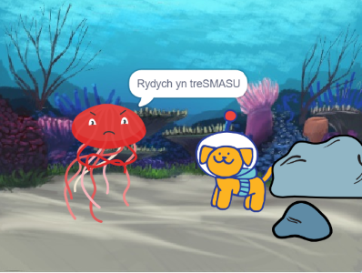

## Ymateb

Nawr, mae angen i'r prif gymeriad ymateb i'r syrpreis. Beth fyddan nhw'n ei wneud? 
- Pryd fyddan nhw'n ymateb?
- Pa fath o emoshlun fyddan nhw'n ei ddefnyddio? 
- Fyddan nhw'n dweud rhywbeth, yn gwneud sŵn, yn newid gwisgoedd, neu'n symud? 

Ti sy'n penderfynu!

### Pryd fydd y cymeriad yn ymateb?

--- task ---

Dewisa'r corlun **cymeriad**. Ychwanega sgript i wneud i'r ymateb ddechrau pan rwyt ti am iddo wneud hynny.

[[[scratch3-time-delay]]]

--- /task ---

### Sut bydd y cymeriad yn ymateb?

--- task ---

Dewisa'r gweithredoedd sy'n gwneud synnwyr i dy gymeriad a'i ymateb.

[[[scratch3-change-costumes-to-show-mood]]]

[[[scratch3-graphic-effects]]]

[[[scratch3-text-to-speech]]]

[[[scratch3-animate-movement-costumes]]]

[[[scratch3-add-sound]]]

[[[scratch3-record-sound]]]

--- /task ---

--- task ---

**Prawf:** Clicia ar y faner werdd. Ydy dy animeiddiad yn llifo fel roeddet ti eisiau iddo wneud? Wyt ti wedi creu tensiwn ac ymateb yn dy stori? Ydy popeth yn ailosod yn gywir pan wyt ti'n clicio ar y faner werdd eto?

--- /task ---

--- task ---

**Difa chwilod:** Efallai bydd angen i ti newid faint o amser sydd yn y blociau `pan amserydd`{:class="block3events"} ac `aros`{:class="block3control"}, neu ychwanegu mwy o flociau `aros`{:class="block3control"}, i gael yr amseru yn iawn.

--- /task ---

--- save ---
