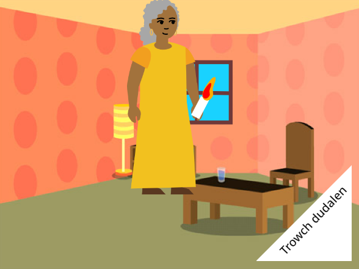

## Beth nesaf?

Os wyt ti'n dilyn y llwybr [Cyflwyniad i Scratch](https://projects.raspberrypi.org/en/pathway/scratch-intro), gallet ti symud ymlaen i'r prosiect [Dw i wedi gwneud llyfr i ti](https://projects.raspberrypi.org/en/projects/i-made-you-a-book). Yn y prosiect hwn, byddi di'n creu llyfr yn Scratch yn seiliedig ar dy syniad eich hun.

--- no-print ---

**Goleuo'r ffordd adref**: [Gweld tu mewn](https://scratch.mit.edu/projects/499860786/editor){:target="_blank"}

  <iframe allowtransparency="true" width="485" height="402" src="https://scratch.mit.edu/projects/embed/499860786/?autostart=false" frameborder="0"></iframe>

--- /no-print ---

--- print-only ---

--- /print-only ---

Os wyt ti am gael mwy o hwyl wrth ddysgu Scratch, gallet ti roi cynnig ar unrhyw un o'r [prosiectau hyn](https://projects.raspberrypi.org/en/projects?software%5B%5D=scratch&curriculum%5B%5D=%201).

