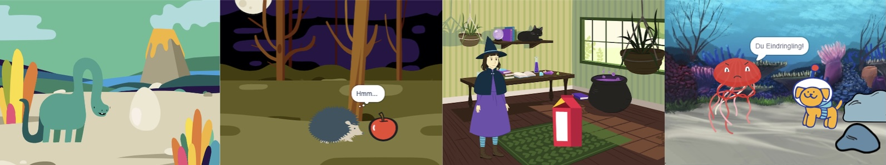
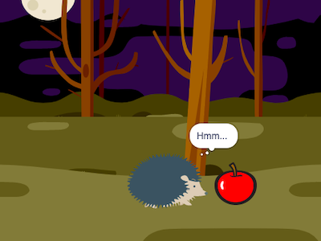

## Das wirst du machen

Erstelle eine kurze Animation 🎥 mit einer lustigen Überraschung 🎉!

Du wirst:

+ Deine eigene Animation erstellen
+ Dein Projekt testen und Fehler suchen und beheben
+ Erstelle deine Animation Schritt für Schritt

--- no-print ---

--- task ---

  

### Spielen ▶️ 

Klicke auf die grüne Flagge, um die Animation anzusehen.

Die Animation besteht aus drei Teilen:
+ Neugier
+ Überraschung!
+ Reaktion

  <iframe allowtransparency="true" width="485" height="402" src="" frameborder="0"></iframe>

--- /task ---

### Hole dir Ideen 💭

--- task ---

Probiere diese Beispielprojekte aus, um Ideen zu bekommen. Überlege, wie deine Animation aussehen könnte, und hole dir einige Ideen bei diesen Beispielprojekten:

⭐ Share your finished Surprise animation project for a chance of it being featured here.

  <iframe allowtransparency="true" width="485" height="402" src="" frameborder="0"></iframe>

  <iframe allowtransparency="true" width="485" height="402" src="" frameborder="0"></iframe>

  <iframe allowtransparency="true" width="485" height="402" src="" frameborder="0"></iframe>

--- /task ---

--- /no-print ---

--- print-only ---

### Hole dir Ideen 💭

You will make design decisions and think of a story for your animation with a surprise. Think about what your story might be, and to get more ideas, **See inside** example projects in the 'Surprise! animation — Examples' Scratch studio: https://scratch.mit.edu/studios/29075822/

Die Animation besteht aus drei Teilen:
+ Neugier
+ Überraschung!
+ Reaktion

 

--- /print-only ---

 
