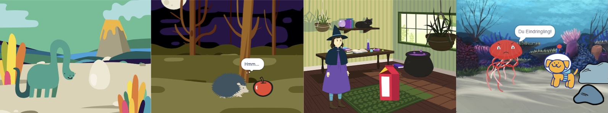

## Das wirst du machen

Erstelle eine kurze Animation 🎥 mit einer lustigen Überraschung 🎉!

Du wirst:

+ Deine eigene Animation erstellen
+ Dein Projekt testen und Fehler suchen und beheben
+ Erstelle deine Animation Schritt für Schritt

--- no-print ---

--- task ---

  

### Spielen ▶️ 

Klicke auf die grüne Flagge, um die Animation anzusehen.

Die Animation besteht aus drei Teilen:
+ Neugier
+ Überraschung!
+ Reaktion

**Dinosaurier-Überraschung!**: [Schau hinein](https://scratch.mit.edu/projects/1208518944/editor){:target="_blank"}

  <iframe allowtransparency="true" width="485" height="402" src="https://scratch.mit.edu/projects/embed/495932563/?autostart=false" frameborder="0"></iframe>

--- /task ---

### Hole dir Ideen 💭

--- task ---

Probiere diese Beispielprojekte aus, um Ideen zu bekommen. Überlege, wie deine Animation aussehen könnte, und hole dir einige Ideen bei diesen Beispielprojekten:

⭐ Teile dein fertiges Überraschung! Animations-Projekt - mit etwas Glück wird es hier vorgestellt.

**BUH!**: [Schau hinein](https://scratch.mit.edu/projects/1207325892/editor){:target="_blank"}

  <iframe allowtransparency="true" width="485" height="402" src="https://scratch.mit.edu/projects/embed/498655116/?autostart=false" frameborder="0"></iframe>

**Katzenmagie**: [Schau hinein](https://scratch.mit.edu/projects/1207326248/editor){:target="_blank"}

  <iframe allowtransparency="true" width="485" height="402" src="https://scratch.mit.edu/projects/embed/498615133/?autostart=false" frameborder="0"></iframe>

**⭐ Schock-Effekt!**: [Schau hinein](https://scratch.mit.edu/projects/720220722/editor){:target="_blank"} (vorgestelltes Community-Projekt)

  <iframe allowtransparency="true" width="485" height="402" src="https://scratch.mit.edu/projects/embed/720220722/?autostart=false" frameborder="0"></iframe>

--- /task ---

--- /no-print ---

--- print-only ---

### Hole dir Ideen 💭

Du wirst Entscheidungen zum Design (Aussehen) treffen und denkst dir eine Geschichte mit einer Überraschung für deine Animation aus. Denke darüber nach, wie deine Geschichte aussehen könnte. **Schau hinein** und sammle weitere Ideen mit den Beispielprojekten in „Überraschung! Animation – Beispiele" aus Scratch Studio: https://scratch.mit.edu/studios/29075822/

Die Animation besteht aus drei Teilen:
+ Neugier
+ Überraschung!
+ Reaktion

 

--- /print-only ---

 
