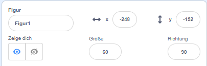
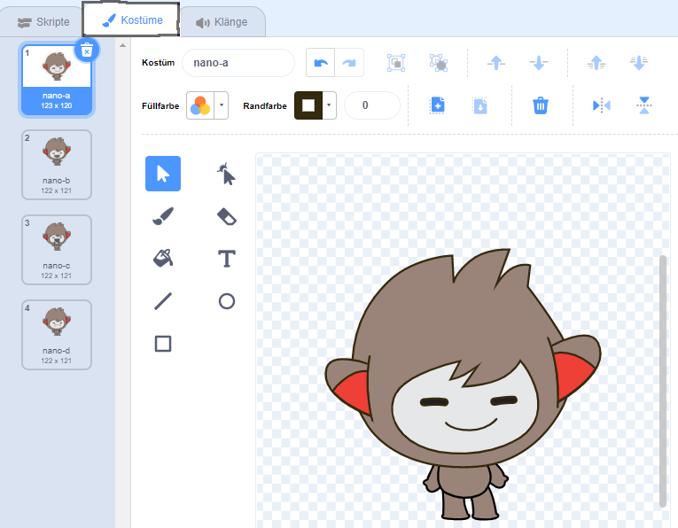
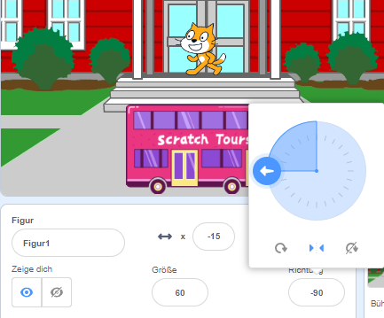

## Erstelle deine Szene

Habst du eine Idee für deine Animation?

Füge einen Hintergrund 🖼️, eine Hauptfigur 🐙👩‍🦼🦖 und ein interessantes Objekt 🎂🎾🎁 deiner Wahl hinzu, um den **ersten Teil** deiner Animation zu erstellen.


<p style="border-left: solid; border-width:10px; border-color: #0faeb0; background-color: aliceblue; padding: 10px;">
  <span style="color: #0faeb0">**Animation**</span> erzeugt einen Bewegungseffekt durch schnelle Bildwechsel. Die ersten Animatoren schnitzten Bilder aus Holzblöcken und verwendeten sie als Stempel. Es ist viel schneller, Scratch zum Programmieren deiner Animation zu verwenden!
</p>

### Öffne das Starterprojekt

--- task ---

Öffne das [Überraschung! Animation Startprojekt](https://scratch.mit.edu/projects/582222532/editor){:target="_blank"}.

⏱️ Wenig Zeit? Du kannst mit einem der [Beispiele](https://scratch.mit.edu/studios/29075822){:target="_blank"} beginnen.

--- /task ---

<p style="border-left: solid; border-width:10px; border-color: #0faeb0; background-color: aliceblue; padding: 10px;">
Es gibt Leute namens <span style="color: #0faeb0">**Narrative Designer**</span>, die Storytelling für Apps und Videospiele machen, also "Geschichtenerzähler" sind. Die Fähigkeit, digitales Geschichten zu erzählen, ermöglicht es jedem, seine Geschichten und kreativen Vorstellungen mit anderen Menschen zu teilen.
</p>

### Gestalten deine Szene

--- task ---

**Wähle:** ein Thema für deine Animation. Du könntest folgendes wählen:

+ 🐯 Landtiere
+ 🐠 Meerestiere
+ 👽 Außerirdische
+ 🌿 Natur
+ 🌈 Wetter
+ 🌮 Essen
+ 🚀 Reisen
+ ⚾ Sport .... Oder etwas anderes

--- /task ---

--- task ---

**Wähle:** Wähle eine Figur als 🐙👩‍🦼🦖 **Hauptfigur**, eine andere Figur als 🎂🎾🎁 **interessantes Objekt** und einen 🖼️ **Hintergrund**, um die Szene zu gestalten.


--- /task ---

### Bereite deine Figuren vor

Wo ist die Startposition deiner Figuren? Wie groß sollen sie sein? Wie möchtest du, dass sie aussehen?

--- task ---

Füge einen Block `Wenn grüne Flagge angeklickt wird`{:class="block3events"} hinzu und füge dann darunter Blöcke hinzu, um die Figuren zu Beginn deiner Animation einzurichten.

**Tipp:** Denke daran, sowohl deine 🐙👩‍🦼🦖 **Hauptfigur** als auch deine 🎂🎾🎁 **interessante Objekt** Figur einzurichten.

--- collapse ---
---
title: Positioniere deine Figuren
---

Bewege die 🐙👩‍🦼🦖 **Hauptfigur** an die gewünschte Position auf der Bühne und füge dann einen `gehe zu x: y:`{:class="block3motion"}-Block zu deinem Code hinzu:

```blocks3
go to x: (0) y: (0) // add the sprite's position
```

Wiederhole diese Aufgabe für das 🎂🎾🎁 **interessante Objekt**.

--- /collapse ---

--- collapse ---
---
title: Passe die Größe deiner Figuren an
---

Um die Größe einer Figur für das gesamte Projekt zu ändern, ändere die Zahl in der Eigenschaft **Größe** im Figuren-Bereich:



Um die Größe eine Figur für einen Teil des Projekts zu ändern, füge Code hinzu, um `setze Größe auf`{:class="block3looks"} die Größe deiner Wahl festzulegen. Diese Option ist gut, wenn du möchtest, dass deine Figur im Projekt seine Größe ändert.

```blocks3
set size to [100] % // <100 is smaller, >100 is bigger
```

--- /collapse ---

--- collapse ---
---
title: Lege die Kostüme deiner Figuren fest
---

Um das Kostüm einer Figur für das gesamte Projekt zu ändern, klicke auf die Registerkarte **Kostüme** und wähle eines der verfügbaren Kostüme aus:



Um das Kostüm einer Figur für einen Teil des Projekts zu ändern, füge deinem Code einen Block `wechsle zu Kostüm`{:class="block3looks"} hinzu und aktualisiere diesen Block, um das Kostüm deiner Wahl anzuzeigen:

```blocks3
switch costume to [ v]  // update this for your chosen costume
```

Um eine Figur zu Beginn des Projekts auszublenden, füge deinem Code den Block `verstecke dich`{:class="block3looks"} hinzu:

```blocks3
hide 
```

--- /collapse ---

--- collapse ---
---
title: Lege die Richtung deiner Figuren fest
---

Deine Figuren sind möglicherweise in die falsche Richtung ausgerichtet, wenn du sie zu deinem Projekt hinzufügst.

Um die Richtung einer Figur für das gesamte Projekt zu ändern, ändere die **Richtung** und den **Drehtyp** im Figuren-Bereich:



Um die Richtung einer Figur für einen Teil des Projekts zu ändern, füge deinem Code Blöcke hinzu, um den ` Drehtyp `{:class="block3motion"} und die ` Richtung `{:class="block3motion"} zu ändern:

```blocks3
set rotation style [left-right v]
point in direction (-90) // turn to the left
```

--- /collapse ---

--- /task ---

--- task ---

Speichere dein Projekt.

[[[generic-scratch3-saving]]]

--- /task ---
