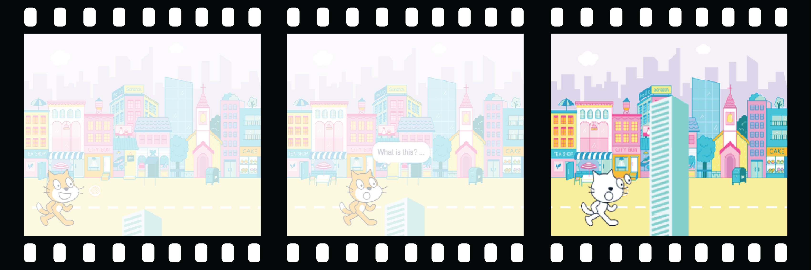

## Füge eine Überraschung hinzu!

Jetzt fügst du noch eine Überraschung hinzu. Was könnte mit dem Objekt passieren?
- Wird es sich in ein anderes Objekt verwandeln?
- Wird es zu einer Figur?
- Wird es verschwinden und eine andere Figur enthüllen?

Es ist deine Entscheidung! Erstelle den **drittenTeil** deiner Animation.



<p style="border-left: solid; border-width:10px; border-color: #0faeb0; background-color: aliceblue; padding: 10px;">
Hast du eine Geschichte mit einer unerwarteten Wendung oder Überraschung geschrieben? Hast du eine Sendung gesehen oder ein Buch gelesen mit einem unvorhersehbaren Ende? Du kannst dieselben Methoden verwenden, wenn du eine digitale Geschichte oder Animation erstellst. 
</p>

### Wann kommt die Überraschung?

--- task ---

Wähle die Figur 🎂🎾🎁 **interessante Objekt** aus. Füge ein Skript hinzu, damit die Überraschung zum gewünschten Zeitpunkt beginnt.

Du musst eine Verzögerung wählen, die für dein Projekt geeignet ist. Wenn du eine Figur verwendest, die lange Zeit neugierig ist, benötigst du eine längere Verzögerung.

```blocks3
when flag clicked
wait (5) seconds // change the number to create your time delay
```

--- /task ---

### Und jetzt sorgst du für die Überraschung!

--- task ---

Das Objekt könnte `einen Ton abspielen`{:class="block3sound"}, `das Kostüm wechseln`{:class="block3looks"}, `Grafikeffekte ändern`{:class="block3looks"} oder `die Größe ändern`{:class="block3looks"}.

Du könntest der Figur ein überraschendes Kostüm hinzufügen, dann könnte die Figur `das Kostüm wechseln`{:class="block3looks"}, um es zu enthüllen.


[[[scratch3-add-costumes-to-a-sprite]]]

Du kannst den Anschein erwecken, als würde sich die Figur in eine andere Figur verwandeln. Dazu verwendest du `verstecke dich`{:class="block3looks"} für die 🎂🎾🎁 **interessante Objekt** Figur und gleichzeitig `zeige dich`{:class="block3looks"} für die andere Figur.

--- collapse ---
---
title: Hide and show sprites
---

Die Figur 🎂🎾🎁 **interessante Objekt**:
```blocks3
when flag clicked
show
wait (5) seconds
hide
```

Die Figur 🎷👻⚡**Überraschungsobjekt**:
```blocks3
when flag clicked
hide
wait (5) seconds
show
```

**Tipp:** Wenn du bei einer 🎷👻⚡**Überraschungsobjekt** Figur `zeige dich`{:class="block3looks"} nutzt, ist es erforderlich, bei `Wenn grüne Flagge angeklickt wird`{:class="block3events"} `verstecke dich`{:class="block3looks"} hinzuzufügen.

--- /collapse ---

--- /task ---

--- task ---

**Test:** Klicke auf die grüne Flagge. Kommt die Überraschung zum richtigen Zeitpunkt? Wird die Animation ordnungsgemäß zurückgesetzt?

--- /task ---

--- task ---

**Fehlersuche:**

Wenn eine Figur vor oder hinter einer anderen Figur stehen soll, kannst du Ebenen verwenden:

[[[scratch3-positioning-with-layers]]]

Kommt die Überraschung zum falschen Zeitpunkt, kannst du das korrigieren:

--- collapse ---
---
title: The surprise starts at the wrong time
---

Möglicherweise ist es erforderlich, dass du die Dauer in einigen oder allen `warte x Sekunden`{:class="block3control"}-Blöcken änderst oder weitere `warte x Sekunden`{:class="block3control"}-Blöcke hinzufügst, um das richtige Timing zu erzielen.

--- /collapse ---

--- /task ---

