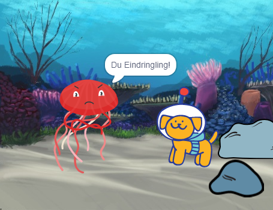

## Verbessere dein Projekt

Du könntest dein Projekt durch das Hinzufügen einer Reaktion verbessern. Wie wird dein Hauptcharakter reagieren? 

Es ist deine Entscheidung!

--- task ---

Was werden sie tun? Werden die Figuren etwas sagen, ein Geräusch machen, das Kostüm wechseln oder sich bewegen?

[[[scratch3-change-costumes-to-show-mood]]]

[[[scratch3-graphic-effects]]]

[[[scratch3-text-to-speech]]]

[[[scratch3-animate-movement-costumes]]]

[[[scratch3-add-sound]]]

[[[scratch3-record-sound]]]

--- /task ---

--- task ---

Du könntest auch:
+ Ergänze oder verbessere deine Animation durch Bewegung, Aussehen und grafischen Effekten
+ Erstelle oder bearbeite deine Kostüme im Zeichen-Editor, um ihnen das gewünschte Aussehen zu verleihen
+ Nehme deine Stimme auf oder nehme Soundeffekte auf und füge die neuen Sounds deinem Projekt hinzu

--- /task ---

Professionelle Programmierer erkunden den Code anderer Programmierer und lassen sich davon inspirieren. 

--- task ---

Du kannst dir auch die Remixe für das [Überraschung! Animation Starter-Projekt](https://scratch.mit.edu/projects/582222532/remixes){:target="_blank"} ansehen, um zu sehen, was andere Ersteller gemacht haben.

--- /task ---

--- task ---

Jedes Projekt in der [„Überraschung! Animation – Beispiele" Scratch Studio](https://scratch.mit.edu/studios/29075822){:target="_blank"} hat einen **Schau hinein** Link, mit dem du das Projekt im Scratch-Editor öffnen und den Code ansehen kannst, um Ideen zu sammeln und zu sehen, wie das Projekt funktioniert.

**Doppelgänger**: [Schau hinein](https://scratch.mit.edu/projects/1207326481/editor){:target="_blank"}

  <iframe allowtransparency="true" width="485" height="402" src="https://scratch.mit.edu/projects/embed/1207326481/?autostart=false" frameborder="0"></iframe>

--- /task ---

--- task ---

Schau dir unsere [„Überraschung! Animation – Community" Scratch-Studio](https://scratch.mit.edu/studios/29079784){:target="_blank"} an, um von Community-Mitgliedern erstellte Projekte anzusehen.

--- /task ---

