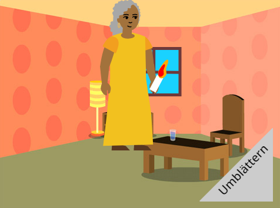

## Wie geht es weiter?

Wenn du dem Pfad [Einführung in Scratch](https://projects.raspberrypi.org/de-DE/pathway/scratch-intro) folgst, kannst du mit dem Projekt „[Ich habe dir ein Buch gemacht](https://projects.raspberrypi.org/de-DE/projects/i-made-you-a-book)“ fortfahren. In diesem Projekt erstellst du in Scratch ein Buch basierend auf deiner eigenen Idee.

--- no-print ---

**Beleuchte den Weg nach Hause**: [Schau hinein](https://scratch.mit.edu/projects/499860786/editor){:target="_blank"}

  <iframe allowtransparency="true" width="485" height="402" src="https://scratch.mit.edu/projects/embed/499860786/?autostart=false" frameborder="0"></iframe>

--- /no-print ---

--- print-only ---

--- /print-only ---

Wenn du mehr Spaß beim Erkunden von Scratch haben möchten, kannst du eines [dieser Projekte](https://projects.raspberrypi.org/de-DE/projects?software%5B%5D=scratch&curriculum%5B%5D=%201) ausprobieren.

***

Dieses Projekt wurde von freiwilligen Helfern übersetzt:

Marc Swenningshon
Arthur Scheiermann

Dank freiwilliger Helfer können wir Menschen auf der ganzen Welt die Möglichkeit geben, in ihrer eigenen Sprache zu lernen. Du kannst uns helfen, mehr Menschen zu erreichen, indem Du dich freiwillig zum Übersetzen meldest - weitere Informationen unter [rpf.io/translate](https://rpf.io/translate).

