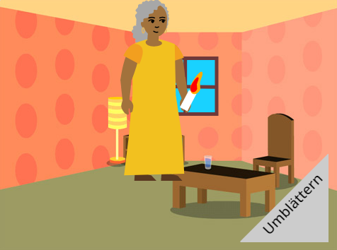

## Wie geht es weiter?

Wenn du dem Pfad [Einführung in Scratch](https://projects.raspberrypi.org/en/pathway/scratch-intro) folgst, kannst du mit dem Projekt „ [Ich habe dir ein Buch gemacht](https://projects.raspberrypi.org/en/projects/i-made-you-a-book) “ fortfahren. In diesem Projekt erstellst du in Scratch ein Buch basierend auf deiner eigenen Idee.

--- no-print ---

**Light the way home**: [See inside](https://scratch.mit.edu/projects/499860786/editor){:target="_blank"}

  <iframe allowtransparency="true" width="485" height="402" src="https://scratch.mit.edu/projects/embed/499860786/?autostart=false" frameborder="0"></iframe>

--- /no-print ---

--- print-only ---

--- /print-only ---

Wenn du mehr Spaß beim Erkunden von Scratch haben möchten, kannst du eines [dieser Projekte](https://projects.raspberrypi.org/en/projects?software%5B%5D=scratch&curriculum%5B%5D=%201)ausprobieren.

