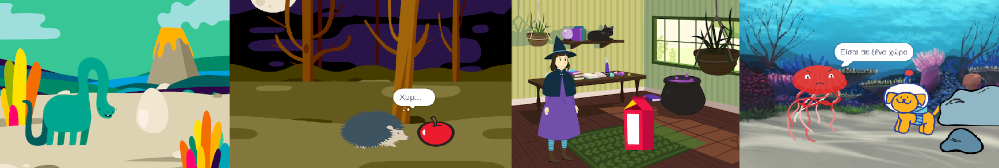
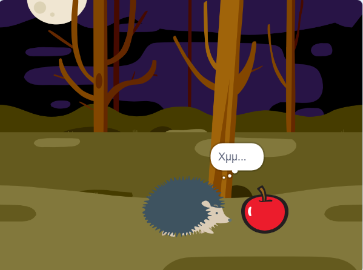

## Τι θα φτιάξεις

Θα δημιουργήσεις μια σύντομο κινούμενο σχέδιο 🎥 με μια διασκεδαστική έκπληξη 🎉!

Θα χρειαστεί να:

+ Δημιουργήσεις το δικό σου κινούμενο σχέδιο
+ Δοκίμασε και διόρθωσε τα σφάλματα στον κώδικά σου
+ Φτιάξε το κινούμενο σχέδιο σου φτιάχνοντας ένα μέρος τη φορά

--- no-print ---

--- task ---

  

### Παίξε ▶️ 

Πάτησε στην πράσινη σημαία για να παρακολουθήσεις το κινούμενο σχέδιο.

Το κινούμενο σχέδιο έχει τρία μέρη:
+ Περιέργεια
+ Έκπληξη!
+ Αντίδραση

**Έκπληξη δεινοσαύρων!**: [Δες μέσα](https://scratch.mit.edu/projects/633584548/editor){:target="_blank"}

  <iframe allowtransparency="true" width="485" height="402" src="https://scratch.mit.edu/projects/embed/633584548/?autostart=false" frameborder="0"></iframe>

--- /task ---

### Βρες ιδέες 💭

--- task ---

Παίξε με αυτά τα παραδείγματα έργων για να πάρεις ιδέες. Σκέψου ποιο μπορεί να είναι το κινούμενο σχέδιο σου και εξερεύνησε αυτά τα παραδείγματα έργων για να πάρεις περισσότερες ιδέες:

⭐ Μοιράσου το ολοκληρωμένο έργο κινουμένων σχεδίων Έκπληξη για να έχεις την ευκαιρία να προβληθεί εδώ.

**ΜΠΟΥ!**: [Δες μέσα](https://scratch.mit.edu/projects/633585290/editor){:target="_blank"}

  <iframe allowtransparency="true" width="485" height="402" src="https://scratch.mit.edu/projects/embed/633585290/?autostart=false" frameborder="0"></iframe>

**Μαγεία Γάτας**: [Δες μέσα](https://scratch.mit.edu/projects/633585774/editor){:target="_blank"}

  <iframe allowtransparency="true" width="485" height="402" src="https://scratch.mit.edu/projects/embed/633585774/?autostart=false" frameborder="0"></iframe>

**⭐ Kοψοχολιάζω!**: [Δες μέσα](https://scratch.mit.edu/projects/720220722/editor){:target="_blank"} (επιλεγμένο έργο κοινότητας)

  <iframe allowtransparency="true" width="485" height="402" src="https://scratch.mit.edu/projects/embed/720220722/?autostart=false" frameborder="0"></iframe>

--- /task ---

--- /no-print ---

--- print-only ---

### Βρες ιδέες 💭

Θα πάρεις σχεδιαστικές αποφάσεις και θα σκεφτείς μια ιστορία για την κινούμενη εικόνα σου με μια έκπληξη. Σκέψου ποια μπορεί να είναι η ιστορία σου και, για να πάρεις περισσότερες ιδέες, **δες μέσα** στα παραδείγματα έργων στο Scratch Studio! 'Surprise! animation — Examples': https://scratch.mit.edu/studios/29075822/

Το κινούμενο σχέδιο έχει τρία μέρη:
+ Περιέργεια
+ 'Εκπληξη!
+ Αντίδραση

 

--- /print-only ---

 
