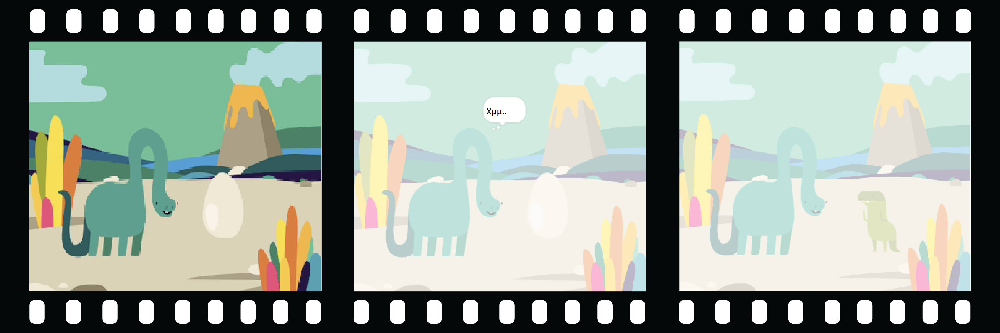

## Δημιούργησε την σκηνή σου

Έχεις κάποια ιδέα για το κινούμενο σχέδιο σου;

Πρόσθεσε ένα υπόβαθρο🖼️, έναν κεντρικό χαρακτήρα 🐙👩‍🦼🦖 και ένα ενδιαφέρον αντικείμενο 🎂🎾🎁 της επιλογής σου για να δημιουργήσεις το **πρώτο μέρος** του κινούμενου σχεδίου σου.



<p style="border-left: solid; border-width:10px; border-color: #0faeb0; background-color: aliceblue; padding: 10px;">
  <span style="color: #0faeb0">**Κινούμενο σχέδιο**</span> δημιουργεί το εφέ της κίνησης αλλάζοντας γρήγορα τις εικόνες. Οι πρώτοι σχεδιαστές κινουμένων σχεδίων χάραξαν εικόνες από ξύλινα κομμάτια και τις χρησιμοποίησαν ως στάμπες. Είναι πολύ πιο γρήγορο να χρησιμοποιείς το Scratch για να προγραμματίσεις το κινούμενο σχέδιο σου!
</p>

### Άνοιξε το αρχικό έργο

--- task ---

Άνοιξε το [ έργο Έκπληξη! αρχικό έργο κινούμενου σχεδίου](https://scratch.mit.edu/projects/582222532/editor){:target="_blank"}.

⏱️ Δεν έχεις πολύ χρόνο; Μπορείς να ξεκινήσεις από ένα από τα [παραδείγματα](https://scratch.mit.edu/studios/29075822){:target="_blank"}.

--- /task ---

<p style="border-left: solid; border-width:10px; border-color: #0faeb0; background-color: aliceblue; padding: 10px;">
Υπάρχουν άνθρωποι που ονομάζονται <span style="color: #0faeb0">**σχεδιαστές αφηγήσεων**</span> που δημιουργούν αφηγήσεις ιστοριών για τις εφαρμογές και τα βιντεοπαιχνίδια. Η ψηφιακή αφήγηση επιτρέπει σε όλους/ες να μοιραστούν τις ιστορίες και τις δημιουργίες τους με άλλους ανθρώπους.
</p>

### Σχεδίασε τη σκηνή σου

--- task ---

**Επίλεξε:** ένα θέμα για το κινούμενο σχέδιο σου. Θα μπορούσες να επιλέξεις:

+ 🐯 Χερσαία ζώα
+ 🐠 Θαλάσσια ζώα
+ 👽 Εξωγήινοι
+ 🌿 Φύση
+ 🌈 Καιρός
+ 🌮 Φαγητό
+ 🚀 Ταξίδι
+ ⚾ Αθλητισμός .... Ή κάτι άλλο

--- /task ---

--- task ---

**Επίλεξε:** Επίλεξε ένα αντικείμενο για να είναι ο 🐙👩‍🦼🦖 **κύριος χαρακτήρας**, ένα άλλο αντικείμενο για να είναι το 🎂🎾🎁 **ενδιαφέρον αντικείμενο** και ένα 🖼️ **υπόβαθρο** για να διαμορφώσεις τη σκηνή.


--- /task ---

### Ετοίμασε τα αντικείμενά σου

Από πού θέλεις να ξεκινήσουν τα αντικείμενά σου; Πόσο μεγάλα θέλεις να είναι; Πώς θέλεις να φαίνονται;

--- task ---

Πρόσθεσε ένα μπλοκ `όταν γίνει κλικ στην πράσινη σημαία`{:class="block3events"} και στη συνέχεια, πρόσθεσε μπλοκ για να ρυθμίσεις τα αντικείμενά σου στην αρχή του κινούμενου σχεδίου σου.

**Συμβουλή:** Θυμήσου να ρυθμίσεις και τους 🐙👩‍🦼🦖 **βασικούς χαρακτήρες** και 🎂🎾🎁 τα **ενδιαφέροντα αντικείμενα**.

--- collapse ---
---
title: Τοποθέτησε τα αντικείμενά σου
---

Μετακίνησε τον 🐙👩‍🦼🦖 **κύριο χαρακτήρα** στη θέση της επιλογής σου στη Σκηνή και στη συνέχεια, πρόσθεσε ένα μπλοκ `πήγαινε στη θέση x: y:`{:class="block3motion"} στον κώδικά σου:

```blocks3
go to x: (0) y: (0) // add the sprite's position
```

Επανάλαβε αυτήν τη διαδικασία και για το **ενδιαφέρον αντικείμενο**.

--- /collapse ---

--- collapse ---
---
title: Άλλαξε το μέγεθος των αντικειμένων σου
---

Για να αλλάξεις το μέγεθος ενός αντικειμένου για ολόκληρο το έργο, άλλαξε τον αριθμό στη μεταβλητή **Μέγεθος** στο παράθυρο του αντικειμένου:


Για να αλλάξεις το μέγεθος ενός αντικειμένου για κάποιο μέρος του έργου, πρόσθεσε κώδικα `όρισε μέγεθος σε`{:class="block3looks"} με το μέγεθος της επιλογής σου. Αυτή η επιλογή είναι καλή αν θέλεις το αντικείμενό σου να αλλάζει μέγεθος κατά τη διάρκεια του έργου.

```blocks3
set size to [100] % // <100 is smaller, >100 is bigger
```

--- /collapse ---

--- collapse ---
---
title: Όρισε τις ενδυμασίες των αντικειμένων σου
---

Για να αλλάξεις την ενδυμασία ενός αντικειμένου για ολόκληρο το έργο, κάνε κλικ στην καρτέλα **Ενδυμασίες** και επίλεξε μία από τις διαθέσιμες ενδυμασίες:


Για να αλλάξεις το κοστούμι ενός αντικειμένου για ένα μέρος του έργου, πρόσθεσε ένα μπλοκ`άλλαξε ενδυμασία σε`{: class = "block3looks"} στον κώδικά σου και ενημέρωσέ τον για να εμφανιστεί το κοστούμι της επιλογής σου:

```blocks3
switch costume to [ v]  // update this for your chosen costume
```

Για να κρύψεις ένα αντικείμενο στην αρχή του έργου, πρόσθεσε ένα μπλοκ `εξαφανίσου`{: class = "block3looks"} στον κώδικά σου:

```blocks3
hide 
```

--- /collapse ---

--- collapse ---
---
title: Όρισε την κατεύθυνση των αντικειμένων σου
---

Τα αντικείμενά σου μπορεί να κοιτάνε σε λάθος τρόπο καθώς τα προσθέτεις στο έργο σου.

Για να αλλάξεις την κατεύθυνση ενός αντικειμένου για ολόκληρο το έργο, άλλαξε την **Κατεύθυνση** και **το στυλ περιστροφής** στο παράθυρο Αντικειμένων:


Για να αλλάξεις την κατεύθυνση ενός αντικειμένου σε ένα μέρος του έργου, πρόσθεσε μπλοκ στον κώδικά σου για να αλλάξεις το `στυλ περιστροφής`{: class = "block3motion"} και την `κατεύθυνση`{: class = "block3motion"}:

```blocks3
set rotation style [left-right v]
point in direction (-90) // turn to the left
```

--- /collapse ---

--- /task ---

--- task ---

Αποθήκευσε το έργο σου.

[[[generic-scratch3-saving]]]

--- /task ---
