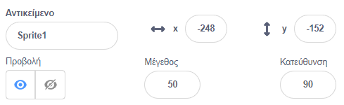
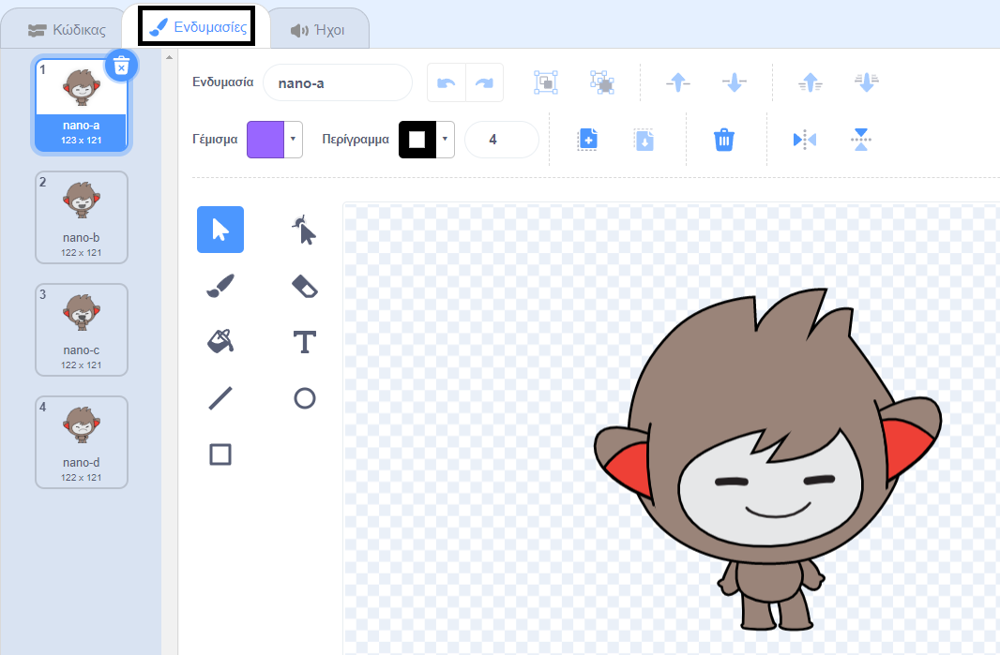
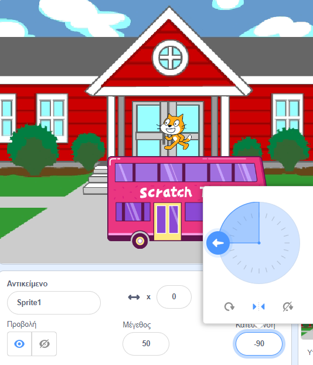

## Προετοιμασία

<div style="display: flex; flex-wrap: wrap">
<div style="flex-basis: 200px; flex-grow: 1; margin-right: 15px;">
Έχεις κάποια ιδέα για την κινούμενη εικόνα σου; 
  
Σε αυτό το βήμα, θα προσθέσεις υπόβαθρο, κύριο χαρακτήρα και ένα ενδιαφέρον αντικείμενο. 
</div>
<div>  


</div>
</div>

--- task ---

Άνοιξε το [ έργο Έκπληξη! κινούμενη εικόνα Έκπληξη!](https://scratch.mit.edu/projects/582222532/editor){:target="_blank"} και ρίξε μία ματιά στα αντικείμενα και τα υπόβαθρα που μπορείς να χρησιμοποιήσεις. Πέρασε λίγο χρόνο να σκεφτείς τον κεντρικό σου χαρακτήρα, το ενδιαφέρον αντικείμενο και το υπόβαθρο.

--- /task ---

--- task ---

**Επίλεξε:** Επίλεξε ένα αντικείμενο για να είναι ο κύριος χαρακτήρας και ένα άλλο αντικείμενο για να είναι το ενδιαφέρον αντικείμενο.


--- /task ---

Πού θέλεις να διαδραματιστεί η κινούμενη εικόνα σου;

--- task ---

**Επίλεξε:** Επίλεξε ένα υπόβαθρο για να στήσεις τη σκηνή.


--- /task ---

Πού θέλεις να ξεκινήσουν οι χαρακτήρες σου; Πόσο μεγάλοι θέλεις να είναι; Πώς θέλεις να φαίνονται;

--- task ---

Πρόσθεσε ένα μπλοκ `όταν γίνει κλικ στην πράσινη σημαία`{:class="block3events"} και, στη συνέχεια, πρόσθεσε μπλοκ για να ρυθμίσεις τα αντικείμενά σου στην αρχή της κινούμενης εικόνας.

Θυμήσου να προετοιμάσεις τόσο τον **κύριο χαρακτήρα σου** όσο και το **ενδιαφέρον αντικείμενό σου**.

--- collapse ---
---
title: Τοποθέτησε τα αντικείμενά σου
---

Για να αλλάξεις τη θέση του αντικειμένου του **κεντρικού χαρακτήρα** για ολόκληρο το έργο, μετακίνησε τον κύριο χαρακτήρα στη θέση της επιλογής σου στη Σκηνή.

Για να αλλάξεις τη θέση του αντικειμένου του **βασικού χαρακτήρα** για κάποιο μέρος του έργου, μετακίνησε τον κύριο χαρακτήρα στη θέση της επιλογής σου στη Σκηνή και, στη συνέχεια, πρόσθεσε ένα μπλοκ `πηγαίνετε στο x: y:`{:class="block3motion"} στον κώδικά σας:

```blocks3
go to x: (0) y: (0) // πρόσθεσε τη θέση του αντικειμένου
```

Επανάλαβε αυτήν τη διαδικασία και για το **ενδιαφέρον αντικείμενο**.

--- /collapse ---

--- collapse ---
---
title: Άλλαξε το μέγεθος των αντικειμένων σου
---

Για να αλλάξεις το μέγεθος ενός αντικειμένου για ολόκληρο το έργο, άλλαξε τον αριθμό στη μεταβλητή **Μέγεθος** στο παράθυρο του αντικειμένου:



Για να αλλάξεις το μέγεθος ενός αντικειμένου για κάποιο μέρος του έργου, πρόσθεσε κώδικα `όρισε μέγεθος σε`{:class="block3looks"} με το μέγεθος της επιλογής σου. Αυτή η επιλογή είναι καλή αν θέλεις το αντικείμενό σου να αλλάζει μέγεθος κατά τη διάρκεια του έργου.

```blocks3
set size to [100] % // <100 είναι μικρότερο, >100 είναι μεγαλύτερο
```

--- /collapse ---

--- collapse ---
---
title: Όρισε τις ενδυμασίες των αντικειμένων σου
---

Για να αλλάξεις την ενδυμασία ενός αντικειμένου για ολόκληρο το έργο, κάνε κλικ στην καρτέλα **Ενδυμασίες** και επίλεξε μία από τις διαθέσιμες ενδυμασίες:



Για να αλλάξεις το κοστούμι ενός αντικειμένου για ένα μέρος του έργου, πρόσθεσε ένα μπλοκ `άλλαξε ενδυμασία σε`{:class="block3looks"} στον κώδικά σου και ενημέρωσέ τον για να εμφανιστεί το κοστούμι της επιλογής σου:

```blocks3
switch costume to [ v]  // ενημέρωσε το για την ενδυμασία που έχεις επιλέξει
```

Για να κρύψεις ένα αντικείμενο στην αρχή του έργου, πρόσθεσε ένα `εξαφανίσου`{:class="block3looks"} στον κώδικά σου:

```blocks3
hide 
```

--- /collapse ---

--- collapse ---
---
title: Όρισε την κατεύθυνση των αντικειμένων σου
---

Τα αντικείμενά σου μπορεί να κοιτάνε σε λάθος τρόπο καθώς τα προσθέτεις στο έργο σου.

Για να αλλάξεις την κατεύθυνση ενός αντικειμένου για ολόκληρο το έργο, άλλαξε την **Κατεύθυνση** και **το στυλ περιστροφής** στο παράθυρο Αντικειμένων:



Για να αλλάξεις την κατεύθυνση ενός αντικειμένου σε ένα μέρος του έργου, πρόσθεσε μπλοκ στον κώδικά σου για να αλλάξεις το `στυλ περιστροφής`{:class="block3motion"} και `κατεύθυνση`{:class="block3motion"}:

```blocks3
set rotation style [left-right v]
point in direction (-90) // στρίψε αριστερά
```

--- /collapse ---

--- /task ---

--- task ---

Αποθήκευσε το έργο σου.

[[[generic-scratch3-saving]]]

--- /task ---

--- save ---
