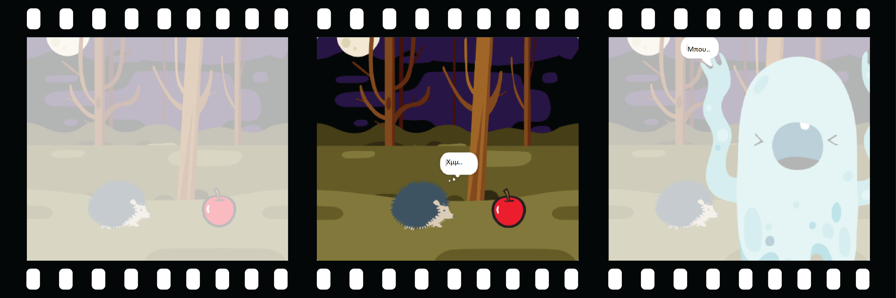

## Δείξε περιέργεια

Θα κάνει κάτι το αντικείμενο για να τραβήξει την προσοχή; Πώς θα αντιδράσει ο χαρακτήρας; Εσύ αποφασίζεις! Δημιούργησε το **δεύτερο μέρος** του κινούμενου σχεδίου σου.



<p style="border-left: solid; border-width:10px; border-color: #0faeb0; background-color: aliceblue; padding: 10px;">
  <span style="color: #0faeb0">Αποδόμηση</span> ονομάζεται ο χωρισμός ενός έργου σε μέρη που είναι μικρότερα και είναι πιο εύκολο να κατανοηθούν. Αυτό σημαίνει ότι μπορείς να επιλύεις ένα μέρος του έργου τη φορά μέχρι να το ολοκληρώσεις. Σε αυτό το βήμα θα εστιάσεις μόνο στο κομμάτι της περιέργειας του κινούμενου σχεδίου σου.
</p>

### Το αντικείμενο

--- task ---

**Επίλεξε:** Εάν θέλεις το 🎂🎾🎁 **ενδιαφέρον αντικείμενο** να κάνει κάτι για να τραβήξει την προσοχή, επίλεξε τι θα κάνει το αντικείμενο.


Πρόσθεσε μπλοκ στο τέλος του 🎂🎾🎁 **ενδιαφέροντος αντικειμένου** `όταν γίνει κλικ σε πράσινη σημαία `{:class="block3events"} στο script προετοιμασίας.

[[[scratch3-jiggle-a-sprite]]]

[[[scratch3-graphic-effects]]]

--- /task ---

### Ο χαρακτήρας

--- task ---

Χρησιμοποίησε τον 🐙👩‍🦼🦖 **κύριο χαρακτήρα** για να δείξεις ενδιαφέρον για το αντικείμενο. Πρόσθεσε μπλοκ στο τέλος του script προετοιμασίας του **κύριου χαρακτήρα **.

Εάν χρειάζεσαι τον 🐙👩‍🦼🦖 **κύριο χαρακτήρα** να περιμένει μέχρι το 🎂🎾🎁 **ενδιαφέρον αντικείμενο** να κάνει κάτι, πρόσθεσε ένα μπλοκ `περίμενε`{:class="block3control"}.


Θα μπορούσες να χρησιμοποιήσεις τα μπλοκ `πες`{:class="block3looks"} ή `σκέψου`{:class="block3looks"} ή ακόμα και να χρησιμοποιήσεις την επέκταση`Κείμενο σε Ομιλία`{:class="block3extensions"} για να κάνεις τον χαρακτήρα να μιλήσει δυνατά!

[[[scratch3-text-to-speech]]]

Ο χαρακτήρας θα μπορούσε να έχει εκφράσεις, όπως στο έργο [Διαστημική συζήτηση](https://projects.raspberrypi.org/en/projects/space-talk){:target="_blank"}.

[[[scratch3-change-costumes-to-show-mood]]]

Ο χαρακτήρας θα μπορούσε να είναι γενναίος και να πλησιάσει για να ελέγξει το αντικείμενο.

[[[scratch3-animate-movement-costumes]]]

--- /task ---

--- task ---

**Δοκιμή:** Κάνε κλικ στην πράσινη σημαία για να δοκιμάσεις το έργο σου. Ο 🐙👩‍🦼🦖 **κύριος χαρακτήρας** θα πρέπει να δείχνει περιέργεια για το αντικείμενο.

Κάνε κλικ στην πράσινη σημαία ξανά. Εάν άλλαξες τη θέση ή την εμφάνιση του αντικειμένου 🎂🎾🎁 **ενδιαφέρον αντικείμενο** ή 🐙👩‍🦼🦖 **κύριος χαρακτήρας**, θα πρέπει να βεβαιωθείς ότι έχουν επιστρέψει στην αρχική τους θέση ή στις αρχικές τους όψεις όταν εκτελέσεις ξανά το έργο.

--- collapse ---
---
title: Όρισε την αρχική θέση και όψη για ένα αντικείμενο
---

Επίλεξε τα μπλοκ που χρειάζεσαι για να ορίσεις τη θέση και την όψη για ένα αντικείμενο στην εκκίνηση.

```blocks3
when flag clicked // add blocks to set up the start 
switch costume to [costume1 v]
set size to (100) % // starting size
go to x: (-200) y: (50) // starting position
point in direction [90]
set [brightness v] effect to [80]
show
```

**Συμβουλή:** Όλα τα εφέ γραφικών διαγράφονται όταν κάνεις κλικ στην πράσινη σημαία, οπότε δεν χρειάζεται να τα διαγράψεις, αλλά ίσως χρειαστεί να ορίσεις τα εφέ που θέλεις να έχει το αντικείμενο.

--- /collapse ---

--- /task ---

--- task ---

**Εντοπισμός σφαλμάτων:**

--- collapse ---
---
τίτλος: Ο ήχος δεν λειτουργεί
---

Βεβαιώσου ότι η ένταση του υπολογιστή ή του tablet σου είναι αρκετά δυνατή και ότι τα ηχεία ή τα ακουστικά σου είναι συνδεδεμένα και λειτουργούν σωστά.

--- /collapse ---

--- collapse ---
---
title: Το κινούμενο σχέδιο μου δεν επανέρχεται σωστά όταν κάνω κλικ στην πράσινη σημαία
---

Έλεγξε ότι το έργο σου έχει script `όταν γίνει κλικ στην πράσινη σημαία `{: class = "block3events"} για τα αντικείμενα που τα χρειάζονται και έλεγξε ότι επαναφέρουν τη θέση, το μέγεθος και τις όψεις των αντικειμένων. Για βοήθεια σε αυτό, συμβουλέψου την ενότητα **Όρισε την αρχική θέση και όψη για ένα αντικείμενο** παραπάνω.

--- /collapse ---

--- /task ---

