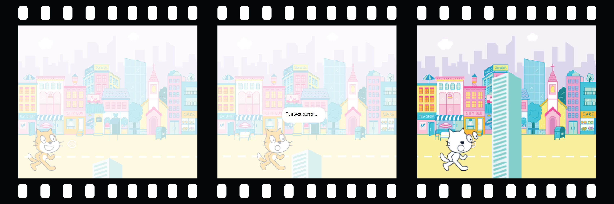

## Πρόσθεσε μια έκπληξη!

Τώρα, πρέπει να προσθέσεις μια έκπληξη. Τι θα μπορούσε να συμβεί στο αντικείμενο;
- Να μετατραπεί σε άλλο αντικείμενο;
- Να μετατραπεί σε χαρακτήρα;
- Να εξαφανιστεί και να εμφανιστεί ένα άλλο αντικείμενο;

Εσύ αποφασίζεις! Δημιούργησε το **τρίτο μέρος** του κινούμενου σχεδίου σου.



<p style="border-left: solid; border-width:10px; border-color: #0faeb0; background-color: aliceblue; padding: 10px;">
Έχεις γράψει μια ιστορία με πλοκή ή με μια έκπληξη; Έχεις παρακολουθήσει μια παράσταση ή έχεις διαβάσει ένα βιβλίο με απρόβλεπτο τέλος; Μπορείς να χρησιμοποιείς τις ίδιες μεθόδους όταν δημιουργείς μια ψηφιακή ιστορία ή κινούμενο σχέδιο. 
</p>

### Πότε θα συμβεί η έκπληξη;

--- task ---

Επίλεξε το αντικείμενο 🎂🎾🎁 **ενδιαφέρον αντικείμενο**. Πρόσθεσε ένα script για να ξεκινήσει η έκπληξη όταν το επιθυμήσεις.

Θα χρειαστεί να επιλέξεις μια χρονική καθυστέρηση που να λειτουργεί για το έργο σου. Εάν έχεις έναν χαρακτήρα που περνάει πολύ χρόνο ως περίεργος, θα χρειαστεί να επιλέξεις μεγαλύτερη καθυστέρηση.

```blocks3
when flag clicked
wait (5) seconds // change the number to create your time delay
```

--- /task ---

### Τώρα, δημιούργησε την έκπληξη!

--- task ---

Το αντικείμενο θα μπορούσε να `παίξει έναν ήχο`{: class = "block3sound"}, να `αλλάξει ενδυμασία`{: class = "block3looks"}, να `αλλάξει εφέ γραφικών`{: class = "block3looks"} ή να `αλλάξει μέγεθος`{: class = "block3looks"}.

Θα μπορούσες να προσθέσεις μια ενδυμασία στο αντικείμενο που να προκαλεί έκπληξη, στη συνέχεια το αντικείμενο θα μπορούσε να `αλλάξει ενδυμασία `{: class = "block3looks"} για να την αποκαλύψει.


[[[scratch3-add-costumes-to-a-sprite]]]

Θα μπορούσες να κάνεις το αντικείμενο να φαίνεται ότι μετατρέτρεπεται σε ένα διαφορετικό αντικείμενο — για να το κάνεις αυτό, `εξαφάνισε`{: class = «block3looks»} το **αντικείμενο** την ίδια στιγμή που `εμφανίζεις `{: class = «block3looks»} ένα άλλο αντικείμενο.

--- collapse ---
---
title: Εξαφάνιση και εμφάνιση αντικειμένων
---

Το 🎂🎾🎁 αντικείμενο **ενδιαφέρον αντικείμενο**:
```blocks3
when flag clicked
show
wait (5) seconds
hide
```

Το 🎷👻⚡αντικείμενο **αντικείμενο έκπληξη**:
```blocks3
when flag clicked
hide
wait (5) seconds
show
```

**Συμβουλή:** Εάν κάνεις ένα 🎷👻⚡ αντικείμενο **αντικείμενο έκπληξη** να `εμφανιστεί`{:class="block3looks"}, θα πρέπει να το `εξαφανίσεις`{:class="block3looks"} `όταν γίνει κλικ στην πράσινη σημαία`{:class="block3events"}.

--- /collapse ---

--- /task ---

--- task ---

**Δοκιμή:** Κάνε κλικ στην πράσινη σημαία. Συμβαίνει η έκπληξη την κατάλληλη στιγμή; Επαναφέρεται το κινούμενο σχέδιο σωστά;

--- /task ---

--- task ---

**Εντοπισμός σφαλμάτων:**

Εάν χρειάζεσαι ένα αντικείμενο να βρίσκεται μπροστά ή πίσω από ένα άλλο αντικείμενο, μπορείς να χρησιμοποιήσεις επίπεδα:

[[[scratch3-positioning-with-layers]]]

Εάν η έκπληξη συμβαίνει σε λάθος στιγμή, μπορείς να το διορθώσεις:

--- collapse ---
---
title: Η έκπληξη ξεκινά τη λάθος στιγμή
---

Ίσως χρειαστεί να αλλάξεις το χρόνο σε μερικά ή σε όλα τα μπλοκ `περίμενε`{:class="block3control"} ή να προσθέσεις άλλα μπλοκ `περίμενε`{:class="block3control"}, για να έχεις τον σωστό χρονισμό.

--- /collapse ---

--- /task ---

