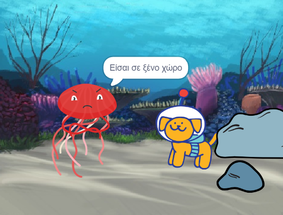

## Αντίδραση

Τώρα, ο κύριος χαρακτήρας πρέπει να αντιδράσει στην έκπληξη. Τι θα κάνουν; 
- Πότε θα αντιδράσουν;
- Τι συναισθήματα θα εκφράσουν; 
- Θα πουν κάτι, θα κάνουν ήχο, θα αλλάξουν ενδυμασίες ή θα μετακινηθούν; 

Εσύ αποφασίζεις!

### Πότε θα αντιδράσει ο χαρακτήρας;

--- task ---

Επίλεξε το αντικείμενο **Χαρακτήρας**. Πρόσθεσε ένα script για να ξεκινήσει η έκπληξη όταν το επιθυμήσεις.

[[[scratch3-time-delay]]]

--- /task ---

### Πώς θα αντιδράσει ο χαρακτήρας;

--- task ---

Επίλεξε τις ενέργειες που έχουν νόημα για τον χαρακτήρα σου και την αντίδρασή τους.

[[[scratch3-change-costumes-to-show-mood]]]

[[[scratch3-graphic-effects]]]

[[[scratch3-text-to-speech]]]

[[[scratch3-animate-movement-costumes]]]

[[[scratch3-add-sound]]]

[[[scratch3-record-sound]]]

--- /task ---

--- task ---

**Δοκιμή:** Κάνε κλικ στην πράσινη σημαία. Η κινούμενη εικόνα σας κινείται όπως θέλεις; Δημιούργησες σασπένς και αντίδραση στην ιστορία σου; Επανέρχονται όλα σωστά όταν κάνεις ξανά κλικ στην πράσινη σημαία;

--- /task ---

--- task ---

**Εντοπισμός σφαλμάτων:** Ίσως χρειαστεί να αλλάξεις το χρονικό διάστημα σε ορισμένα ή σε όλα τα `όταν χρονόμετρο`{:class="block3events"} και `περίμενε`{class="block3control"} ή πρόσθεσε περισσότερα `περίμενε`{:class="block3control"} μπλοκ, για να έχεις τον κατάλληλο χρόνο.

--- /task ---

--- save ---
