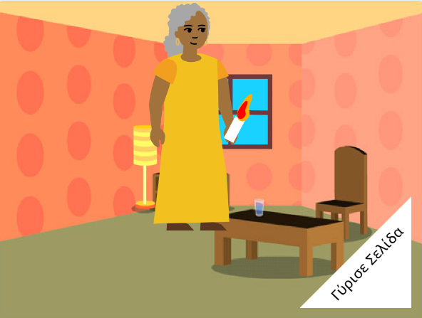

## Τι υπάρχει στη συνέχεια;

Εάν ακολουθείς το μονοπάτι[Εισαγωγή στο Scratch](https://projects.raspberrypi.org/en/pathway/scratch-intro), μπορείς να προχωρήσεις στο έργο [Σου έφτιαξα ένα βιβλίο](https://projects.raspberrypi.org/en/projects/i-made-you-a-book). Σε αυτό το έργο, θα φτιάξεις ένα βιβλίο στο Scratch βασισμένο στη δική σου ιδέα.

Θα μπορούσες επίσης να δείξεις στην οικογένειά σου πώς λειτουργεί το έργο σου.

**Light the way home**: [See inside](https://scratch.mit.edu/projects/499860786/editor){:target="_blank"}

  <iframe allowtransparency="true" width="485" height="402" src="https://scratch.mit.edu/projects/embed/499860786/?autostart=false" frameborder="0"></iframe>

[[[share-scratch]]]

--- print-only ---

[[[comments-feedback-scratch]]]

Αν θέλεις να διασκεδάσεις περισσότερο εξερευνώντας το Scratch, τότε μπορείς να δοκιμάσεις οποιοδήποτε από [αυτά τα έργα](https://projects.raspberrypi.org/en/projects?software%5B%5D=scratch&curriculum%5B%5D=%201).

