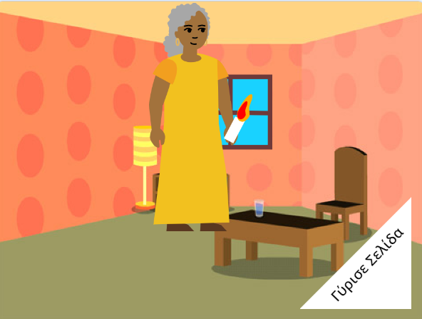

## Τι υπάρχει στη συνέχεια;

Εάν ακολουθείς το μονοπάτι[Εισαγωγή στο Scratch](https://projects.raspberrypi.org/en/pathway/scratch-intro), μπορείς να προχωρήσεις στο έργο [Σου έφτιαξα ένα βιβλίο](https://projects.raspberrypi.org/en/projects/i-made-you-a-book). Σε αυτό το έργο, θα φτιάξεις ένα βιβλίο στο Scratch βασισμένο στη δική σου ιδέα.

--- no-print ---

  <iframe allowtransparency="true" width="485" height="402" src="" frameborder="0"></iframe>

--- /no-print ---

--- print-only ---

--- /print-only ---

Αν θέλεις να διασκεδάσεις περισσότερο εξερευνώντας το Scratch, τότε μπορείς να δοκιμάσεις οποιοδήποτε από [αυτά τα έργα](https://projects.raspberrypi.org/en/projects?software%5B%5D=scratch&curriculum%5B%5D=%201).

