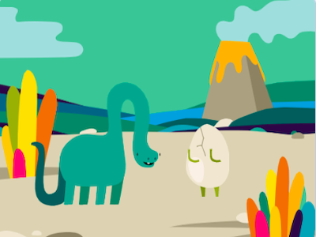
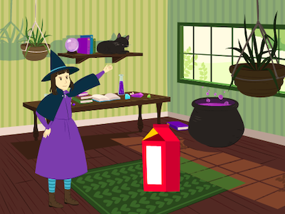
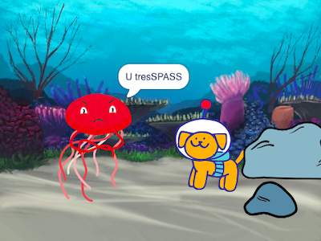

## Introduction

You will create a short animation with a surprise.

You will:
+ Use Scratch to create an animation,
+ Test and debug your code when you make changes,
+ Break an animation into parts, this is called **decomposition**, and build it one part at a time.

**Decomposition** is breaking a project down into parts that are smaller and easier to understand. This means that you can build a project one part at a time until you have completed it. 

--- no-print ---

--- task ---

  

### Try it 

Click the green flag to start the animation.

The animation has four parts:
+ Setup
+ Curiosity
+ Surprise!
+ Reaction

**Dinosaur surprise!**: [See inside](https://scratch.mit.edu/projects/495932563/editor){:target="_blank"}

  <iframe allowtransparency="true" width="485" height="402" src="https://scratch.mit.edu/projects/embed/495932563/?autostart=false" frameborder="0"></iframe>

--- /task ---

Have you written a story with a plot twist or a surprise? Maybe you have watched a show or read a book with an unpredictable ending? You can use the same methods when creating a digital story or animation. 

### Get inspiration 

--- task ---

You are going to make design decisions and come up with a story for your surprise animation.  You will need to **set up** the scene with character and curious object, show the character's curiosity about the object, create a surprise, and add a reaction. 

Think about what your story might be as you explore these example projects to get more ideas:

**BOO!**: [See inside](https://scratch.mit.edu/projects/498655116/editor){:target="_blank"}

  <iframe allowtransparency="true" width="485" height="402" src="https://scratch.mit.edu/projects/embed/498655116/?autostart=false" frameborder="0"></iframe>

**Cat magic**: [See inside](https://scratch.mit.edu/projects/498615133/editor){:target="_blank"}

  <iframe allowtransparency="true" width="485" height="402" src="https://scratch.mit.edu/projects/embed/498615133/?autostart=false" frameborder="0"></iframe>

**Tresspass**: [See inside](https://scratch.mit.edu/projects/498616008/editor){:target="_blank"}

  <iframe allowtransparency="true" width="485" height="402" src="https://scratch.mit.edu/projects/embed/498616008/?autostart=false" frameborder="0"></iframe>

--- /task ---

--- /no-print ---

--- print-only ---

Have you written a story with a plot twist or a surprise? Maybe you have watched a show or read a book with an unpredictable ending? You can use the same methods when creating a digital story or animation. 

### Get inspiration 

You are going to make design decisions and come up with a story for your surprise animation.  You will need to **set up** the scene with character and curious object, show the character's curiosity about the object, create a surprise, and add a reaction.  [Scratch 1: Surprise story - Examples](https://scratch.mit.edu/studios/29075822/){:target="_blank"} Scratch studio.

The animation has four stages:
+ Setup
+ Curiosity
+ Surprise!
+ Reaction

--- /print-only ---

There are people called narrative designers who do storytelling for apps and video games. But digital storytelling allows everyone to share their stories and creative imaginings with other people.

 
