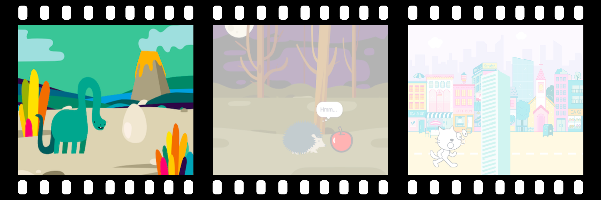
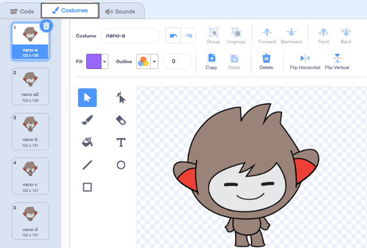

## Create your scene

<div style="display: flex; flex-wrap: wrap">
<div style="flex-basis: 200px; flex-grow: 1; margin-right: 15px;">
Have you got an idea about your animation? 
  
In this step, you will add a backdrop, main character, and interesting object. 
</div>
<div>  

</div>
</div>



--- task ---

Open the [surprise! animation starter project](https://scratch.mit.edu/projects/582222532/editor){:target="_blank"} and look at the range of sprites and backdrops that you can use. 

Spend some time thinking about your main character, interesting object, and backdrop. You could choose:

+ 🐯 Land Animals
+ 🐠 Sea animals 
+ 👽 Aliens
+ 🌿 Nature
+ 🌈 Weather
+ 🌮 Food
+ 🚀 Travel
+ ⚾ Sport
.... Or something else

--- /task ---

--- task ---

**Choose:** Choose a sprite to be the **main character** and another sprite to be the **interesting object.**


--- /task ---

Where do you want your animation to take place?

--- task ---

**Choose:** Choose a backdrop to set the scene. 


--- /task ---

### Setup

Where do you want your sprites to start? How big do you want them to be? How do you want them to look?

--- task ---

Add a `when green flag clicked`{:class="block3events"} block, then, underneath, add blocks to set up your sprites at the start of your animation. 

**Tip:** Remember to set up both your **main character** and your **interesting object** sprites.

--- collapse ---
---
title: Position your sprites
---

Move the main character to the position of your choice on the Stage, then add a `go to x: y:`{:class="block3motion"} block to your code:

```blocks3
go to x: (0) y: (0) // add the sprite's position
```

Repeat this task for the **interesting object**. 

--- /collapse ---

--- collapse ---
---
title: Resize your sprites
---

To change the size of a sprite for the whole project, change the number in the **Size** property in the Sprite pane:


To change the size of a sprite for part of the project, add code to `set size to`{:class="block3looks"} the size of your choice. This option is good if you want your sprite to change size in the project. 

```blocks3
set size to [100] % // <100 is smaller, >100 is bigger
```

--- /collapse ---

--- collapse ---
---
title: Set the costumes of your sprites
---

To change the costume of a sprite for the whole project, click on the **Costumes** tab and select one of the available costumes:



To change the costume of a sprite for part of the project, add a `switch costume to`{:class="block3looks"} block to your code and update it to show the costume of your choice:

```blocks3
switch costume to [ v]  // update this for your chosen costume
```

To hide a sprite at the start of the project, add a `hide`{:class="block3looks"} block to your code:

```blocks3
hide 
```

--- /collapse ---

--- collapse ---
---
title: Set the direction of your sprites
---

Your sprites might be facing the wrong way when you add them to your project. 

To change the direction of a sprite for the whole project, change the **Direction** and **rotation style** in the Sprite pane:


To change the direction of a sprite for part of the project, add blocks to your code to change the `rotation style`{:class="block3motion"} and `direction`{:class="block3motion"}:

```blocks3
set rotation style [left-right v]
point in direction (-90) // turn to the left
```

--- /collapse ---

--- /task ---

--- task ---

Save your project.

[[[generic-scratch3-saving]]]

--- /task ---

--- save ---
