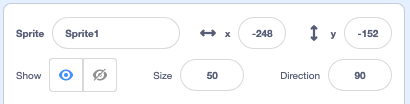

## Setup

Have you got an idea about your story? In this step, add a backdrop, main character and interesting object. 

--- task ---

Open a [new Scratch project](https://scratch.mit.edu/projects/editor){:target=”_blank”} to look at the range of sprites and backdrops. Spend some time thinking about your main character, interesting object and backdrop.

--- /task ---

--- task ---

Choose a sprite for your main character and another sprite to be the interesting object.

[[[generic-scratch3-sprite-from-library]]]


--- collapse ---

---
title: Paint your own character or object
---

You can create a character from shapes using the rectangle and oval tools. 

Don't add the eyes, they need to be separate sprites.


--- /collapse ---

--- /task ---

Where do you want your story to take place?

--- task ---

Your animation can take place anywhere you like. **Choose** a backdrop to set the scene. 

[[[generic-scratch3-backdrop-from-library]]]

--- /task ---

Where do you want your sprites to be at the beginning of the story? How big will they be? How should they look?

--- task ---

Getting your sprites ready for the start of the story is an important task. You will need to add code `when flag clicked`{:class="block3events"} to reset your sprites at the beginning of your animation. 

Remember to set up both your main character and your interesting object.

--- collapse ---

---
title: Position your sprites
---

To change the position of your sprite for the whole project, move your main character to a good position on the Stage. 

To change the position of your sprite for part of the project, move your main character to a good position on the Stage then add a `go to x y`{:class="block3motion"} block to your code.

```blocks3
go to x: (0) y: (0) // with your coordinates
```

Repeat this task for your interesting object. 

--- /collapse ---

--- collapse ---

---
title: Resize your sprites
---

To change the size of your sprite for the whole project, change the size property in the Sprite pane:



To change the size of your sprite for part of the project, add code to `set size to`{:class="block3looks"} the size you want. This option is good if you want your sprite to change size in the project. 

```blocks3
set size to [100%] // <100% smaller, >100% bigger
```

--- /collapse ---

--- collapse ---

---
title: Set costume of your sprite
---

To change the costume of your sprite for the whole project, click on the Costumes tab and select one of the available costumes. 


To change the costume of your sprite for part of the project, add a `switch costume to`{:class="block3looks"} block to your code and update to show your chosen costume.

```blocks3
switch costume to [ v]  // update for your costume
```

To `hide`{:class="block3looks"} your sprite at the start of your project add a `hide`{:class="block3looks"} block to your code.

```blocks3
hide 
```

--- /collapse ---

--- collapse ---

---
title: Set the direction of your sprites
---

Your sprites might be facing the wrong way when you add them to your project. 

To change the direction of your sprite for the whole project, change the direction property and rotation style in the Sprite pane:


To change the direction of your sprite for part of the project, add blocks to your code to change the `rotation style`{:class="block3motion"} and `direction`{:class="block3motion"}.

```blocks3
set rotation style [left-right v]
point in direction (-90) // turn to the left
```

--- /collapse ---

--- /task ---

--- task ---

Save your project

<mark>name-and-save-my-project</mark>

--- /task ---

--- save ---