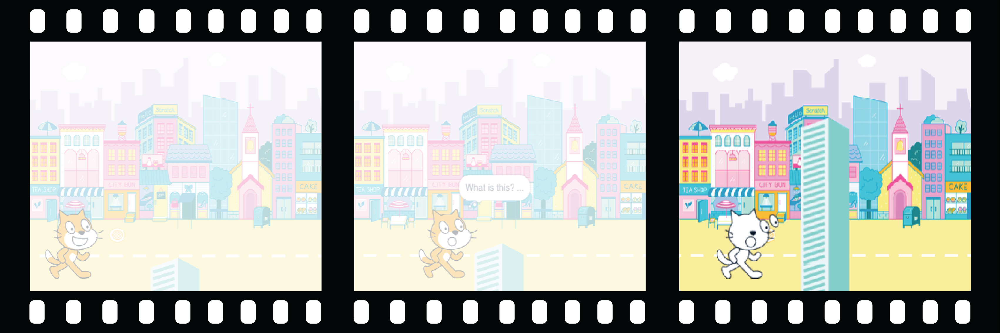

## Add a surprise!

Now, you need to add a surprise. What could happen to the object? 
- Will it turn into another object? 
- Will it turn into a character? 
- Will it disappear and reveal another sprite? 

You decide! Create the **third part** of your animation. 



<p style="border-left: solid; border-width:10px; border-color: #0faeb0; background-color: aliceblue; padding: 10px;">
Have you written a story with a plot twist or a surprise? Have you watched a show or read a book with an unpredictable ending? You can use the same methods when you create a digital story or animation. 
</p>

### When will the surprise happen?

--- task ---

Select the 🎂🎾🎁 **interesting object** sprite. Add a script to make the surprise start when you want it to. 

You will need to choose a time delay that works for your project. If you have a character that spends a long time being curious, you will need to choose a longer delay.

```blocks3
when flag clicked
wait (5) seconds // change the number to create your time delay
```

--- /task ---

### Now, create the surprise!

--- task ---

The object could `play a sound`{:class="block3sound"}, `switch costume`{:class="block3looks"}, `change graphic effects`{:class="block3looks"}, or `change size`{:class="block3looks"}.

You could add a surprising costume to the sprite, then the sprite could `switch costume`{:class="block3looks"} to reveal it.


[[[scratch3-add-costumes-to-a-sprite]]]

You could make the sprite seem to turn into a different sprite — to do this, `hide`{:class="block3looks"} the 🎂🎾🎁 **interesting object** sprite at the same time as you `show`{:class="block3looks"} another sprite.

--- collapse ---
---
title: Hide and show sprites
---

The 🎂🎾🎁 **interesting object** sprite:
```blocks3
when flag clicked
show
wait (5) seconds
hide
```

The 🎷👻⚡**surprise object** sprite:
```blocks3
when flag clicked
hide
wait (5) seconds
show
```

**Tip:** If you make a 🎷👻⚡**surprise object** sprite `show`{:class="block3looks"}, you will need to make it `hide`{:class="block3looks"} `when green flag clicked`{:class="block3events"}.

--- /collapse ---

--- /task ---

--- task ---

**Test:** Click on the green flag. Does the surprise happen at the right time? Does the animation reset properly?

--- /task ---

--- task ---

**Debug:**

If you need a sprite to be in front of or behind another sprite, you can use layers:

[[[scratch3-positioning-with-layers]]]

If the surprise happens at the wrong time, you can fix that:

--- collapse ---
---
title: The surprise starts at the wrong time
---

You might need to change the amount of time in some or all of the `wait`{:class="block3control"} blocks, or add more `wait`{:class="block3control"} blocks, to get the timing just right.

--- /collapse ---

--- /task ---

