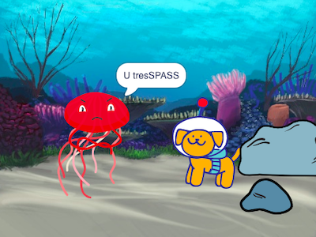

## Reaction

Now, your main character needs to react to the surprise. What will they do? 
- When will your main character react?
- How will they emote? 
- Will they say something, make a sound, change costumes, move? 

You decide!

### When will your character react?

--- task ---

Select your **character** sprite. Add a script to start the reaction. 

[[[scratch3-time-delay]]]

--- /task ---

### How will your character react?

--- task ---

Choose the actions that make sense for your character and their reaction. 

[[[scratch3-change-costumes-to-show-mood]]]

[[[scratch3-graphic-effects]]]

[[[scratch3-text-to-speech]]]

[[[scratch3-animate-movement-costumes]]]

[[[scratch3-add-sound]]]

[[[scratch3-record-sound]]]

--- /task ---

--- task ---

**Test:** Click on the green flag. Does your animation flow as you want it to? Have you created suspense and a reaction in your surprise story? Does everything reset correctly when you click on the green flag again?

--- /task ---

--- task ---

**Debug:** 

You might need to change the time in `when timer`{:class="block3events"} and `wait`{:class="block3control"} blocks or add more `wait`{:class="block3control"} blocks to get the timing just right.

--- /task ---

--- save ---
