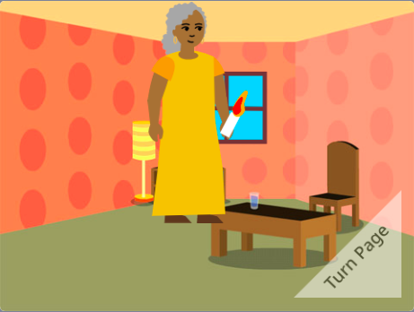

## What next?

If you are following the [Introduction to Scratch](https://projects.raspberrypi.org/en/pathway/scratch-intro) path, you can move on to the [I made you a book](https://projects.raspberrypi.org/en/projects/i-made-you-a-book) project. In this project, you will make a (add description here).

--- no-print ---
**Light the way home**: [See inside](https://scratch.mit.edu/projects/499860786/editor){:target="_blank"}

  <iframe allowtransparency="true" width="485" height="402" src="https://scratch.mit.edu/projects/embed/499860786/?autostart=false" frameborder="0"></iframe>

--- /no-print ---

--- print-only ---

--- /print-only ---

If you want to have more fun exploring Scratch, then you could try out any of [these projects](https://projects.raspberrypi.org/en/projects?software%5B%5D=scratch&curriculum%5B%5D=%201).

