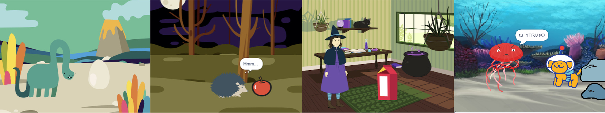
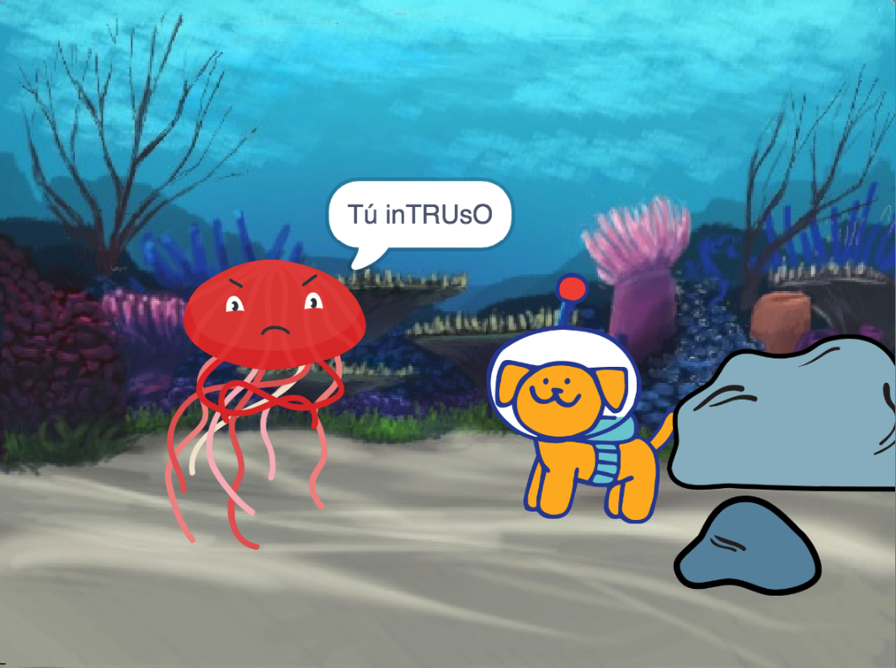

## Introducción

Crea una animación corta con una sorpresa.

Vas a:

+ Usar Scratch para crear una animación
+ Probar y depurar tu código cuando hagas cambios
+ Dividir una animación en partes (a esto se le llama **descomposición**) y armar una parte a la vez

  **Descomposición** es dividir un proyecto en partes más pequeñas y más fáciles de entender. Esto significa que puedes construir un proyecto una parte a la vez hasta que lo hayas completado. 

--- no-print ---

--- task ---

  

### Pruébalo

Haz clic en la bandera verde para ver la animación.

La animación tiene cuatro partes:
+ Configuración
+ Curiosidad
+ ¡Sorpresa!
+ Reacción

**¡Sorpresa! Dinosaurio**: [Ver dentro](https://scratch.mit.edu/projects/495932563/editor){:target="_blank"}

  <iframe allowtransparency="true" width="485" height="402" src="https://scratch.mit.edu/projects/embed/495932563/?autostart=false" frameborder="0"></iframe>

--- /task ---

### Inspírate

--- task ---

Tomarás decisiones de diseño y pensarás en una historia para tu animación con una sorpresa.

Piensa en cuál podría ser tu historia y explora estos proyectos de ejemplo para obtener más ideas:

**BOO!**: [Ver dentro](https://scratch.mit.edu/projects/498655116/editor){:target="_blank"}

  <iframe allowtransparency="true" width="485" height="402" src="https://scratch.mit.edu/projects/embed/498655116/?autostart=false" frameborder="0"></iframe>

**Magia de gato**: [Ver dentro](https://scratch.mit.edu/projects/498615133/editor){:target="_blank"}

  <iframe allowtransparency="true" width="485" height="402" src="https://scratch.mit.edu/projects/embed/498615133/?autostart=false" frameborder="0"></iframe>

**Intruso**: [Ver dentro](https://scratch.mit.edu/projects/498616008/editor){:target="_blank"}

  <iframe allowtransparency="true" width="485" height="402" src="https://scratch.mit.edu/projects/embed/498616008/?autostart=false" frameborder="0"></iframe>

--- /task ---

--- /no-print ---

--- print-only ---

### Inspírate

Tomarás decisiones de diseño y pensarás en una historia para tu animación con una sorpresa. Piensa en cuál podría ser tu historia, y explora estos proyectos de ejemplo para obtener más ideas, **Ver dentro** proyectos de ejemplo en '¡Sorpresa! animación - Ejemplos del Estudio Scratch: https://scratch.mit.edu/studios/29075822/

La animación tiene cuatro partes:
+ Configuración
+ Curiosidad
+ ¡Sorpresa!
+ Reacción

   

--- /print-only ---

Hay personas llamadas **diseñadores narrativos** que crean historias para aplicaciones y videojuegos. Pero la narración digital permite que todos compartan sus historias e imaginaciones creativas con otras personas.

 
