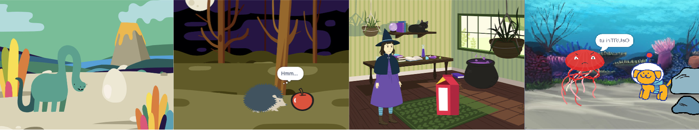
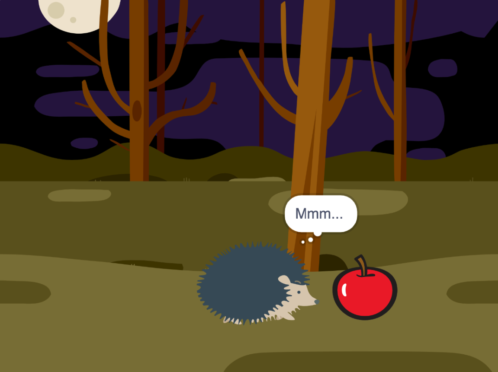

## Lo que harás

¡Crea una animación corta 🎥 con una sorpresa 🎉!

Vas a:

+ Crea tu propia animación
+ Prueba y depura tu código
+ Crea tu animación de parte en parte

--- no-print ---

--- task ---

  

### Reproducir ▶️ 

Haz clic en la bandera verde para ver la animación.

La animación tiene cuatro partes:
+ Curiosidad
+ ¡Sorpresa!
+ Reacción

**Dinosaur surprise!**: [See inside](https://scratch.mit.edu/projects/495932563/editor){:target="_blank"}

  <iframe allowtransparency="true" width="485" height="402" src="https://scratch.mit.edu/projects/embed/495932563/?autostart=false" frameborder="0"></iframe>

--- /task ---

### Obtén ideas 💭

--- task ---

Explora estos proyectos de ejemplo para obtener más ideas. Piensa en cuál podría ser tu historia y explora estos proyectos de ejemplo para obtener más ideas:

⭐ Comparte tu proyecto de animación sorpresa y ten la oportunidad de que se muestre aquí.

**BOO!**: [See inside](https://scratch.mit.edu/projects/498655116/editor){:target="_blank"}

  <iframe allowtransparency="true" width="485" height="402" src="https://scratch.mit.edu/projects/embed/498655116/?autostart=false" frameborder="0"></iframe>

**Cat magic**: [See inside](https://scratch.mit.edu/projects/498615133/editor){:target="_blank"}

  <iframe allowtransparency="true" width="485" height="402" src="https://scratch.mit.edu/projects/embed/498615133/?autostart=false" frameborder="0"></iframe>

**⭐ Jumpscare!**: [See inside](https://scratch.mit.edu/projects/720220722/editor){:target="_blank"} (featured community project)

  <iframe allowtransparency="true" width="485" height="402" src="https://scratch.mit.edu/projects/embed/720220722/?autostart=false" frameborder="0"></iframe>

--- /task ---

--- /no-print ---

--- print-only ---

### Obtén ideas 💭

Tomarás decisiones de diseño y pensarás en una historia para tu animación con una sorpresa. Piensa en cuál podría ser tu historia, y explora estos proyectos de ejemplo para obtener más ideas, **Ver dentro** proyectos de ejemplo en '¡Sorpresa! animación - Ejemplos del Estudio Scratch: https://scratch.mit.edu/studios/29075822/

La animación tiene cuatro partes:
+ Curiosidad
+ ¡Sorpresa!
+ Reacción

 

--- /print-only ---

 
