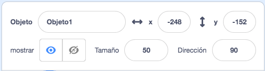
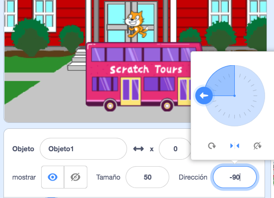

## Create your scene

Have you got an idea about your animation?

Add a backdrop 🖼️, main character 🐙👩‍🦼🦖, and interesting object 🎂🎾🎁 of your choice to create the **first part** of your animation.


<p style="border-left: solid; border-width:10px; border-color: #0faeb0; background-color: aliceblue; padding: 10px;">
  <span style="color: #0faeb0">**Animation**</span> creates the effect of movement by changing pictures quickly. The first animators carved pictures out of wooden blocks and used them as stamps. It is much faster to use Scratch to code your animation!
</p>

### Abre el proyecto inicial

--- task ---

Open the [Surprise! animation starter project](https://scratch.mit.edu/projects/582222532/editor){:target="_blank"}.

⏱️ Not much time? You can start from one of the [examples](https://scratch.mit.edu/studios/29075822){:target="_blank"}.

--- /task ---

<p style="border-left: solid; border-width:10px; border-color: #0faeb0; background-color: aliceblue; padding: 10px;">
There are people called <span style="color: #0faeb0">**narrative designers**</span> who do storytelling for apps and video games. La narración digital permite que todos compartan sus historias e imaginaciones creativas con otras personas.
</p>

### Design your scene

--- task ---

**Elige:** un tema para tu animación. Podrías elegir:

+ 🐯 Land Animals
+ 🐠 Sea animals
+ 👽 Aliens
+ 🌿 Nature
+ 🌈 Weather
+ 🌮 Food
+ 🚀 Travel
+ ⚾ Sport .... Or something else

--- /task ---

--- task ---

**Elige:** Elige un objeto para que sea el 🐙👩‍🦼🦖 **el personaje principal**, otro objeto para que sea el 🎂🎾🎁 **un objeto interesante** y un 🖼️ **ícono de fondo** para ambientar la escena.


--- /task ---

### Prepare your sprites

Where do you want your sprites to start? How big do you want them to be? How do you want them to look?

--- task ---

Add a `when green flag clicked`{:class="block3events"} block, then, underneath, add blocks to set up your sprites at the start of your animation.

**Consejo:** Recuerda configurar tanto tu 🐙👩‍🦼🦖 **personaje principal** como tu 🎂🎾🎁 **objeto interesante**.

--- collapse ---
---
title: Posiciona tus objetos
---

Move the 🐙👩‍🦼🦖 **main character** to the position of your choice on the Stage, then add a `go to x: y:`{:class="block3motion"} block to your code:

```blocks3
go to x: (0) y: (0) // add the sprite's position
```

Repeat this task for the 🎂🎾🎁 **interesting object**.

--- /collapse ---

--- collapse ---
---
title: Cambia el tamaño de tus objetos
---

To change the size of a sprite for the whole project, change the number in the **Size** property in the Sprite pane:



To change the size of a sprite for part of the project, add code to `set size to`{:class="block3looks"} the size of your choice. This option is good if you want your sprite to change size in the project.

```blocks3
set size to [100] % // <100 is smaller, >100 is bigger
```

--- /collapse ---

--- collapse ---
---
title: Configura los disfraces de tus objetos
---

To change the costume of a sprite for the whole project, click on the **Costumes** tab and select one of the available costumes:


To change the costume of a sprite for part of the project, add a `switch costume to`{:class="block3looks"} block to your code and update it to show the costume of your choice:

```blocks3
switch costume to [ v]  // update this for your chosen costume
```

To hide a sprite at the start of the project, add a `hide`{:class="block3looks"} block to your code:

```blocks3
hide 
```

--- /collapse ---

--- collapse ---
---
title: Configura la dirección de tus objetos
---

Your sprites might be facing the wrong way when you add them to your project.

To change the direction of a sprite for the whole project, change the **Direction** and **rotation style** in the Sprite pane:



To change the direction of a sprite for part of the project, add blocks to your code to change the `rotation style`{:class="block3motion"} and `direction`{:class="block3motion"}:

```blocks3
set rotation style [left-right v]
point in direction (-90) // turn to the left
```

--- /collapse ---

--- /task ---

--- task ---

Guarda tu proyecto.

[[[generic-scratch3-saving]]]

--- /task ---
