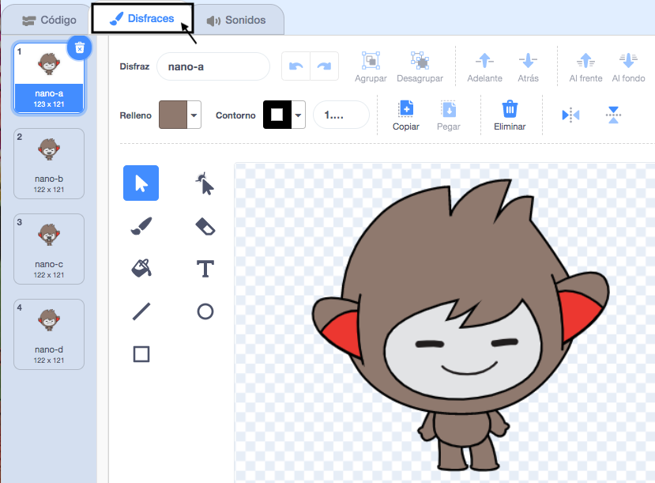

## Crea tu escena

¿Tienes alguna idea sobre tu animación?

Agrega un fondo 🖼️, un personaje principal 🐙👩‍🦼🦖 y un objeto interesante 🎂🎾🎁 de tu elección para crear la **primera parte** de tu animación.


<p style="border-left: solid; border-width:10px; border-color: #0faeb0; background-color: aliceblue; padding: 10px;">
  <span style="color: #0faeb0">** Animación **</span> crea el efecto de movimiento al cambiar las imágenes rápidamente. Los primeros animadores tallaron imágenes en bloques de madera y los utilizaron como sellos. ¡Es mucho más rápido usar Scratch para programar tu animación!
</p>

### Abre el proyecto inicial

--- task ---

Abre la [¡Sorpresa! proyecto de iniciación de animación](https://scratch.mit.edu/projects/582222532/editor){:target="_blank"}.

⏱️ ¿Poco tiempo? Puedes comenzar con uno de los [ejemplos](https://scratch.mit.edu/studios/29075822){:target="_blank"}.

--- /task ---

<p style="border-left: solid; border-width:10px; border-color: #0faeb0; background-color: aliceblue; padding: 10px;">
Hay personas llamadas <span style="color: #0faeb0">**diseñadores narrativos**</span> que crean historias para aplicaciones y videojuegos. La narración digital permite que todos compartan sus historias e imaginaciones creativas con otras personas.
</p>

### Diseña tu escena

--- task ---

**Elige:** un tema para tu animación. Podrías elegir:

+ 🐯 Animales Terrestres
+ 🐠 Animales marinos
+ 👽 Extraterrestres
+ 🌿 Naturaleza
+ 🌈 Clima
+ 🌮 Comida
+ 🚀 Viajes
+ ⚾ Deporte .... U otra cosa

--- /task ---

--- task ---

**Elige:** Elige un objeto para que sea el 🐙👩‍🦼🦖 **el personaje principal**, otro objeto para que sea el 🎂🎾🎁 **un objeto interesante** y un 🖼️ **ícono de fondo** para ambientar la escena.


--- /task ---

### Organiza tus objetos

¿Dónde quieres que empiecen tus objetos? ¿Qué tan grandes quieres que sean? ¿Cómo quieres que luzcan?

--- task ---

Agrega un bloque`al presionar la bandera verde`{:class="block3events"}, luego, debajo, agrega bloques para configurar tus objetos al comienzo de tu animación.

**Consejo:** Recuerda configurar tanto tu 🐙👩‍🦼🦖 **personaje principal** como tu 🎂🎾🎁 **objeto interesante**.

--- collapse ---
---
title: Posiciona tus objetos
---

Mueve al 🐙👩‍🦼🦖 **personaje principal** a la posición que elijas en el escenario, luego agrega un bloque `ir a x: y:`{:class="block3motion"} a tu código:

```blocks3
go to x: (0) y: (0) // add the sprite's position
```

Repite esta tarea para el 🎂🎾🎁 **objeto interesante**.

--- /collapse ---

--- collapse ---
---
title: Cambia el tamaño de tus objetos
---

Para cambiar el tamaño de un objeto para todo el proyecto, cambia el número en la propiedad **Tamaño** en el Panel:


Para cambiar el tamaño de un objeto para una parte del proyecto, agrega código a `fijar tamaño a`{:class="block3looks"} el tamaño de su elección. Esta es una buena opción si quieres que tu objeto cambie de tamaño en el proyecto.

```blocks3
set size to [100] % // <100 is smaller, >100 is bigger
```

--- /collapse ---

--- collapse ---
---
title: Configura los disfraces de tus objetos
---

Para cambiar el disfraz de un objeto para todo el proyecto, haz clic en la pestaña **Disfraces** y selecciona uno de los disponibles:



Para cambiar el disfraz de un objeto para una parte del proyecto, agrega un bloque `cambiar disfraz a`{:class="block3looks"} a tu código y actualízalo para que se muestre el de tu elección:

```blocks3
switch costume to [ v]  // update this for your chosen costume
```

Para ocultar un objeto al inicio del proyecto, agrega un bloque `esconder`{:class="block3looks"} a tu código:

```blocks3
hide 
```

--- /collapse ---

--- collapse ---
---
title: Configura la dirección de tus objetos
---

Es posible que tus objetos estén orientados de manera incorrecta cuando los agregues a tu proyecto.

Para cambiarle la dirección para todo el proyecto, cambia la **Dirección** y el **Estilo de rotación** en el Panel de objetos:


Para cambiar la dirección de un objeto una para parte del proyecto, agrega bloques a tu código para cambiar el `estilo de rotación`{:class="block3motion"} y la `dirección`{:class="block3motion"}:

```blocks3
set rotation style [left-right v]
point in direction (-90) // turn to the left
```

--- /collapse ---

--- /task ---

--- task ---

Guarda tu proyecto.

[[[generic-scratch3-saving]]]

--- /task ---
