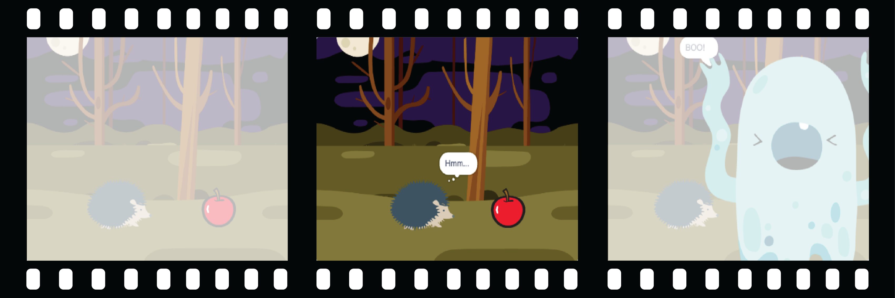
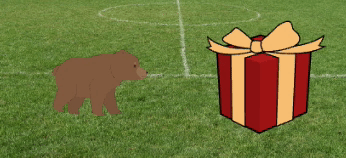

## Demuestra curiosidad

¿El objeto hará algo para llamar la atención? ¿Cómo reaccionará el personaje? ¡Tú decides! Crea la **segunda parte** de tu animación.



<p style="border-left: solid; border-width:10px; border-color: #0faeb0; background-color: aliceblue; padding: 10px;">
  <span style="color: #0faeb0">**Descomposición**</span> es dividir un proyecto en partes más pequeñas y más fáciles de entender. Esto significa que puedes construir un proyecto una parte a la vez hasta que lo hayas completado. En este paso, te concentrarás solo en la curiosidad de tu animación.
</p>

### El objeto

--- task ---

**Elige:** Si deseas que el objeto haga algo, elige lo que hará.


Agrega bloques al final del 🎂🎾🎁 **objeto interesante** `cuando la bandera verde hizo clic en`{:class="block3events"} la configuración del script.

[[[scratch3-jiggle-a-sprite]]]

[[[scratch3-graphic-effects]]]

--- /task ---

### El personaje

--- task ---

Haz que el 🐙👩‍🦼🦖 **personaje principal** muestre interés en el objeto. Agrega bloques al final del script de configuración del 🐙👩‍🦼🦖 **personaje principal**.

Si necesitas que el 🐙👩‍🦼🦖 **personaje principal** espere hasta que el 🎂🎾🎁 **objeto interesante** haya hecho algo, agregue un bloque `wait`{:class="block3control"}.



Puedes usar bloques `decir`{:class="block3looks"} o `pensar`{:class="block3looks"}, o incluso usar la extensión `Texto a Voz`{:class="block3extensions"} ¡para hacerlo hablar!

[[[scratch3-text-to-speech]]]

El personaje podría emocionarse, como en el proyecto [Conversación espacial](https://projects.raspberrypi.org/es-LA/projects/space-talk){:target="_blank"}.

[[[scratch3-change-costumes-to-show-mood]]]

El personaje podría ser valiente y acercarse a ver el objeto.

[[[scratch3-animate-movement-costumes]]]

--- /task ---

--- task ---

**Prueba:** Haz clic en la bandera verde para probar tu proyecto. El 🐙👩‍🦼🦖 **personaje principal** debe mostrar curiosidad por el objeto.

Vuelve a hacer clic en la bandera verde. Si cambiaste la posición o el aspecto del 🎂🎾🎁 **objeto interesante** o del 🐙👩‍🦼🦖 **personaje principal**, tendrás que asegurarte de que vuelva a su posición o aspecto inicial cuando ejecutes el proyecto de nuevo.

--- collapse ---
---
title: Establece la posición y apariencia iniciales del objeto
---

Elige los bloques que necesitas para establecer la posición y apariencia del objeto al principio.

```blocks3
when flag clicked // agrega bloques para configurar el inicio 
switch costume to [disfraz1 v]
set size to (100) % // tamaño inicial
go to x: (-200) y: (50) // posición inicial
point in direction [90]
set [brillo v] effect to [80]
show
```

**Consejo:** Todos los efectos gráficos se borran cuando haces clic en la bandera verde, por lo que no necesitas borrarlos, pero es posible que debas configurar los efectos que deseas que el objeto tenga.

--- /collapse ---

--- /task ---

--- task ---

**Debug:**

--- collapse ---
---
title: El sonido no funciona
---

Verifica que el volumen de tu computadora o tableta sea lo suficientemente alto y que tus parlantes o audífonos estén conectados y funcionando correctamente.

--- /collapse ---

--- collapse ---
---
title: Mi animación no se restablece correctamente cuando hago clic en la bandera verde
---

Verifica que tu proyecto tenga scripts `al presionar bandera verde ⚑`{:class="block3events"} para los objetos que los necesitan, y verifica que restablezcan la posición, tamaño y apariencia de los objetos. Para obtener ayuda sobre esto, consulta la tarea de arriba **Establece la posición inicial y apariencia del objeto**.

--- /collapse ---

--- /task ---

