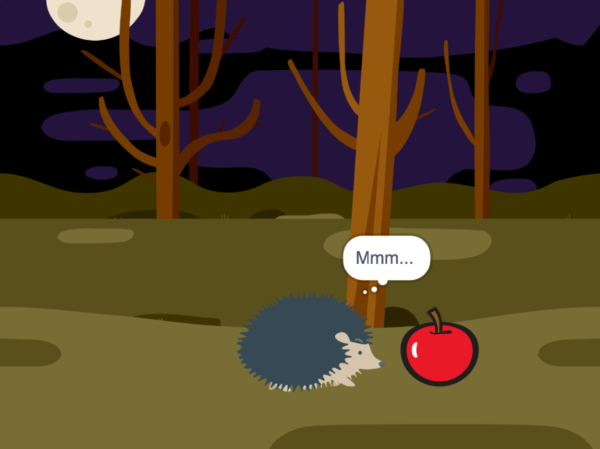

## Curiosidad

<div style="display: flex; flex-wrap: wrap">
<div style="flex-basis: 200px; flex-grow: 1; margin-right: 15px;">
¿El objeto hará algo para llamar la atención? ¿Cómo reaccionará el personaje?

¡Tú decides!
</div>
<div>



</div>
</div>

### El objeto

--- task ---

**Elige:** Si deseas que el objeto haga algo, elige lo que hará.

Agrega bloques al final del script de configuración del **objeto** `al presionar bandera verde ⚑`{:class="block3events"}.

[[[scratch3-jiggle-a-sprite]]]

[[[scratch3-graphic-effects]]]

--- /task ---

### El personaje

--- task ---

Haz que el personaje principal muestre interés en el objeto. Agrega bloques al final del script de configuración del **personaje**.

Si necesitas que el personaje espere hasta que el objeto haya hecho algo, agrega un bloque `esperar`{:class="block3control"}.

Puedes usar bloques `decir`{:class="block3looks"} o `pensar`{:class="block3looks"}, o incluso usar la extensión `Texto a Voz`{:class="block3extensions"} ¡para hacer al personaje hablar!

[[[scratch3-text-to-speech]]]

El personaje podría emocionarse, como en el proyecto [Conversación espacial](https://projects.raspberrypi.org/es-LA/projects/space-talk){:target="_blank"}.

[[[scratch3-change-costumes-to-show-mood]]]

El personaje podría ser valiente y acercarse para ver el objeto.

[[[scratch3-animate-movement-costumes]]]

--- /task ---

--- task ---

**Prueba:** Haz clic en la bandera verde para probar tu proyecto. El personaje debe mostrar curiosidad por el objeto.

Vuelve a hacer clic en la bandera verde. Si cambiaste la posición o el aspecto del objeto del **personaje** o del **objeto**, tendrás que asegurarte de que vuelva a su posición o aspecto inicial cuando ejecutes el proyecto de nuevo.

--- collapse ---
---
title: Establece la posición y apariencia iniciales del objeto
---

Elige los bloques que necesitas para establecer la posición y apariencia del objeto al principio.

```blocks3
when flag clicked // agrega bloques para configurar el inicio 
switch costume to [costume1 v]
set size to (100) % // tamaño inicial
go to x: (-200) y: (50) // posición inicial
point in direction [90]
set [brightness v] effect to [80]
show
```

**Sugerencia:** Todos los efectos gráficos se borran cuando haces clic en la bandera verde, por lo que no necesitas borrarlos, pero es posible que debas configurar los efectos que deseas que el objeto tenga.

--- /collapse ---

--- /task ---

--- task ---

**Depurar:**

--- collapse ---
---
title: El sonido no funciona
---

Verifica que el volumen de tu computadora o tableta sea lo suficientemente alto y que tus parlantes o audífonos estén conectados y funcionando correctamente.

--- /collapse ---

--- collapse ---
---
title: Mi animación no se restablece correctamente cuando hago clic en la bandera verde
---

Verifica que tu proyecto tenga scripts `al presionar bandera verde ⚑`{:class="block3events"} para los objetos que los necesitan, y verifica que restablezcan la posición, tamaño y apariencia de los objetos. Para obtener ayuda sobre esto, consulta la tarea de arriba **Establece la posición inicial y apariencia del objeto**.

--- /collapse ---

--- /task ---

--- save ---
