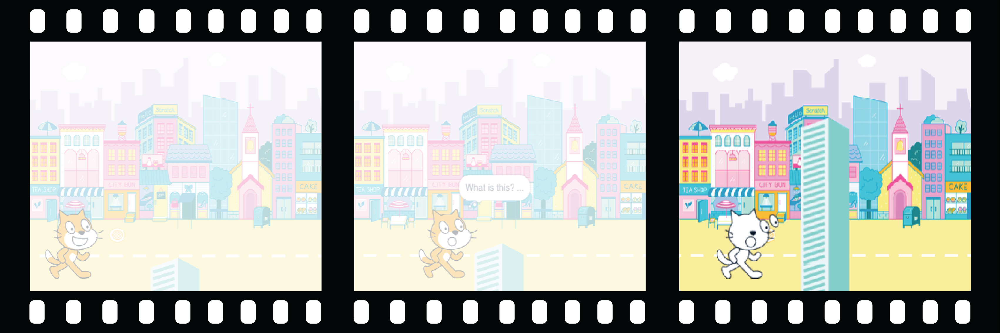

## ¡Añade una sorpresa!

Ahora necesitas agregar una sorpresa. ¿Qué podría pasarle al objeto?
- ¿Se convertirá en otro objeto?
- ¿Se convertirá en un personaje?
- ¿Desaparecerá y revelará otro objeto?

¡Tú decides! Crea la **tercera parte** de tu animación.



<p style="border-left: solid; border-width:10px; border-color: #0faeb0; background-color: aliceblue; padding: 10px;">
¿Alguna vez has escrito una historia con un giro de la trama o una sorpresa? ¿Has visto un programa o leído un libro con un final impredecible? Puede utilizar los mismos métodos al crear una historia o animación digital. 
</p>

### ¿Cuándo ocurrirá la sorpresa?

--- task ---

Selecciona el 🎂🎾🎁 **objeto interesante**. Agrega un script para que la sorpresa comience cuando lo desees.

Deberás elegir un tiempo de espera que funcione para tu proyecto. Si tienes un personaje que pasa mucho tiempo siendo curioso, deberás elegir un mayor tiempo de espera.

```blocks3
when flag clicked
wait (5) seconds // change the number to create your time delay
```

--- /task ---

### ¡Ahora, crea la sorpresa!

--- task ---

El objeto podría `reproducir un sonido`{:class="block3sound"}, `cambiar de disfraz`{:class="block3looks"}, `cambiar de efectos gráficos`{:class="block3looks"} o `cambiar de tamaño`{:class="block3looks"}.

Podrías agregar un disfraz increíble al objeto, luego podría `cambiar de disfraz`{:class="block3looks"} para revelarlo.


[[[scratch3-add-costumes-to-a-sprite]]]

Puedes hacer que la figura parezca convertirse en otra diferente - para hacerlo, `esconde`{:class="block3looks"} los 🎂🎾🎁 **objeto interesante** al mismo tiempo que `muestra`{:class="block3looks"} otro objeto.

--- collapse ---
---
title: Esconde y muestra objetos
---

Los 🎂🎾🎁 **objeto interesante** figura:
```blocks3
when flag clicked
show
wait (5) seconds
hide
```

Los 🎷👻⚡**objeto sorpresa** figura:
```blocks3
when flag clicked
hide
wait (5) seconds
show
```

**Consejo:** Si haces que un 🎷👻⚡**objeto sorpresa** `mostrar`{:class="block3looks"}, tendrás que hacerlo `ocultar`{:class="block3looks"} `cuando se haga clic en la bandera verde`{:clase="block3events"}.

--- /collapse ---

--- /task ---

--- task ---

**Prueba:** Haz clic en la bandera verde. ¿Ocurre la sorpresa en el momento adecuado? ¿La animación se reinicia correctamente?

--- /task ---

--- task ---

**Debug:**

Si necesitas que un objeto esté delante o detrás de otro objeto, puedes utilizar capas:

[[[scratch3-positioning-with-layers]]]

Si la sorpresa ocurre en el momento equivocado, puedes solucionarlo:

--- collapse ---
---
título: La sorpresa comienza en el momento equivocado
---

Es posible que deba cambiar la cantidad de tiempo en algunos o en todos `esperar`{:class="block3control"} los bloques, o agregar más `esperar`{:clase="block3control"} bloques, para obtener el tiempo correcto.

--- /collapse ---

--- /task ---

