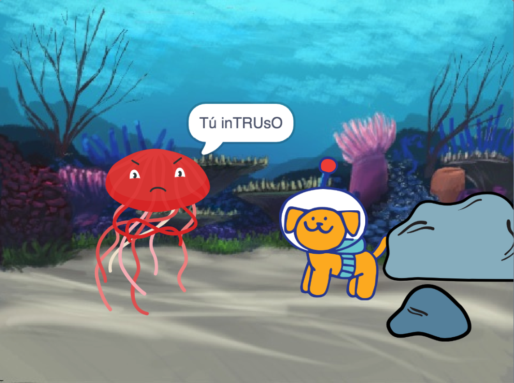

## Mejora tu proyecto

Puedes mejorar tu proyecto agregando una reacción. ¿Cómo reaccionará tu personaje principal? 

¡Tú decides!

--- task ---

¿Qué harán? - ¿Dirá algo, hará un sonido, cambiará de disfraz o se moverá?

[[[scratch3-change-costumes-to-show-mood]]]

[[[scratch3-graphic-effects]]]

[[[scratch3-text-to-speech]]]

[[[scratch3-animate-movement-costumes]]]

[[[scratch3-add-sound]]]

[[[scratch3-record-sound]]]

--- /task ---

--- task ---

También puedes:
+ Añade o mejora tu animación, con movimiento, atuendos y efectos gráficos
+ Crea o edita disfraces en el Editor de dibujo para que se vean como tú quieras
+ Graba tu voz o efectos de sonido y agregalos a tu proyecto

--- /task ---

Los programadores profesionales exploran y se inspiran en el código creado por otros programadores. 

--- task ---

También puedes ver las mezclas del [ proyecto de iniciación en animación Sorpresa ](https://scratch.mit.edu/projects/582222532/remixes){:target="_blank"} para ver lo que otros creadores han construido.

--- /task ---

--- task ---

Cada proyecto en [ ¡Sorpresa! animación - Ejemplos de 'Scratch studio](https://scratch.mit.edu/studios/29075822){:target="_ blank"} tiene una opción **Ver dentro**, que puedes usar para abrir el proyecto en el editor de Scratch y mirar el código para obtener ideas y ver cómo funciona.

  <iframe allowtransparency="true" width="485" height="402" src="" frameborder="0"></iframe>

--- /task ---

--- task ---

¡Echa un vistazo a nuestra [¡Sorpresa! animación - Comunidad del estudio Scratch ](https://scratch.mit.edu/studios/29079784){:target="_ blank"} para ver proyectos creados por miembros de la comunidad.

--- /task ---

