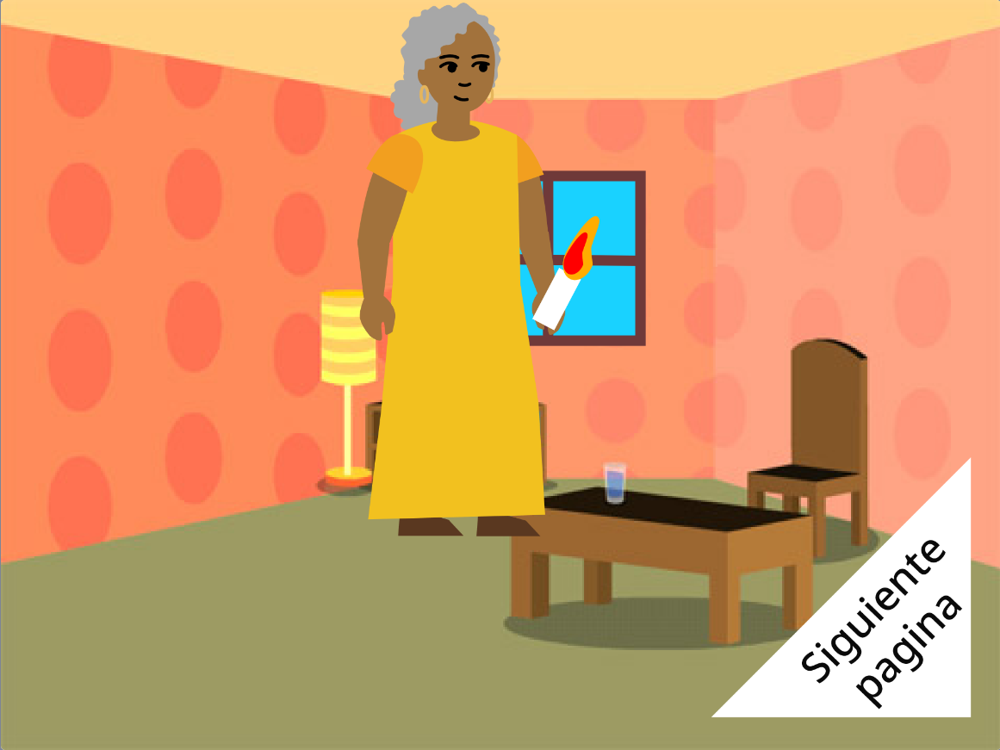

## ¿Qué sigue?

Si estás siguiendo la ruta [Introducción a Scratch](https://projects.raspberrypi.org/en/pathway/scratch-intro), puedes pasar al proyecto [Te hice un libro](https://projects.raspberrypi.org/en/projects/i-made-you-a-book). En este proyecto, harás un libro en Scratch basado en tus propias ideas.

--- no-print ---

**Ilumina el camino a casa**: [Ver dentro](https://scratch.mit.edu/projects/499860786/editor){:target="_ blank"}

  <iframe allowtransparency="true" width="485" height="402" src="https://scratch.mit.edu/projects/embed/499860786/?autostart=false" frameborder="0"></iframe>

--- /no-print ---

--- print-only ---

--- /print-only ---

Si quieres divertirte más explorando Scratch, entonces puedes probar cualquiera de [estos proyectos](https://projects.raspberrypi.org/en/projects?software%5B%5D=scratch&curriculum%5B%5D=%201).

