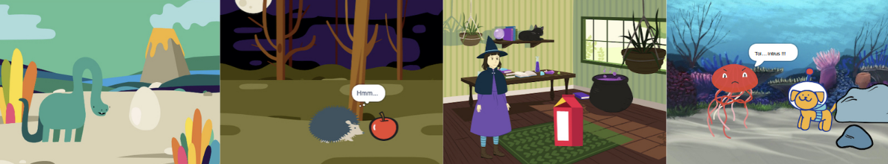
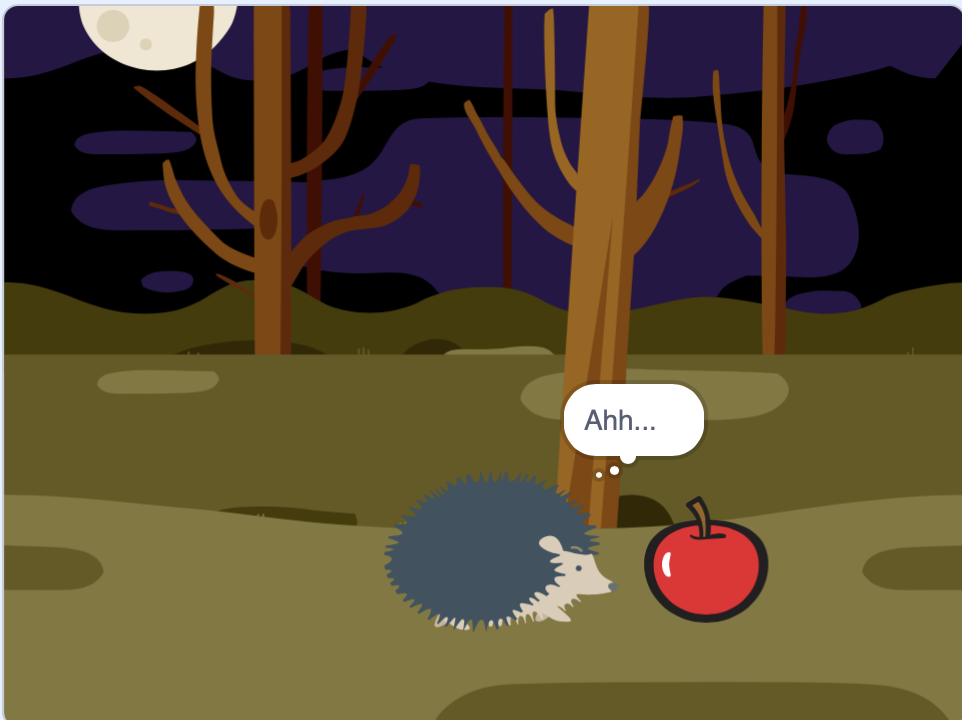

## Ce que tu vas faire

Créer une courte animation 🎥 avec une surprise 🎉 !

Tu vas devoir :

+ Créer ta propre animation
+ Tester et déboguer ton code
+ Construire ton animation une partie à la fois

--- no-print ---

--- task ---

  

### Joue ▶️ 

Clique sur le drapeau vert pour regarder l'animation.

L'animation comporte trois parties :
+ Curiosité
+ Surprise !
+ Réaction

  <iframe allowtransparency="true" width="485" height="402" src="" frameborder="0"></iframe>

--- /task ---

### Trouve l'inspiration 💭

--- task ---

Joue avec ces exemples de projets pour trouver des idées. Réfléchis à ce que pourrait être ton animation et explore ces exemples de projets pour obtenir plus d'idées :

⭐ Partage ton projet d'animation Surprise terminé pour avoir une chance qu'il soit présenté ici.

  <iframe allowtransparency="true" width="485" height="402" src="" frameborder="0"></iframe>

  <iframe allowtransparency="true" width="485" height="402" src="" frameborder="0"></iframe>

  <iframe allowtransparency="true" width="485" height="402" src="" frameborder="0"></iframe>

--- /task ---

--- /no-print ---

--- print-only ---

### Trouve l'inspiration 💭

Tu prendras des décisions de conception et penseras à une histoire pour ton animation avec une surprise. Réfléchis à ce que pourrait être ton histoire et pour obtenir plus d'idées, **Voir à l'intérieur** exemples de projets dans la section « Surprise »! animation — Scratch studio exemples : https://scratch.mit.edu/studios/29075822/

L'animation comporte trois parties :
+ Curiosité
+ Surprise !
+ Réaction

 

--- /print-only ---

 
