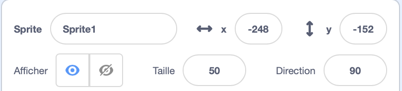
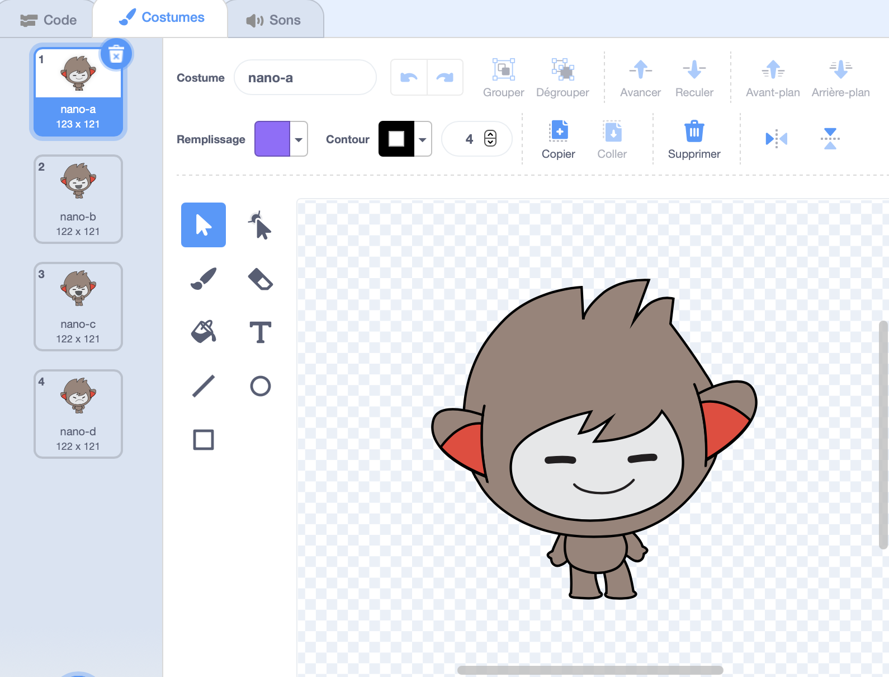
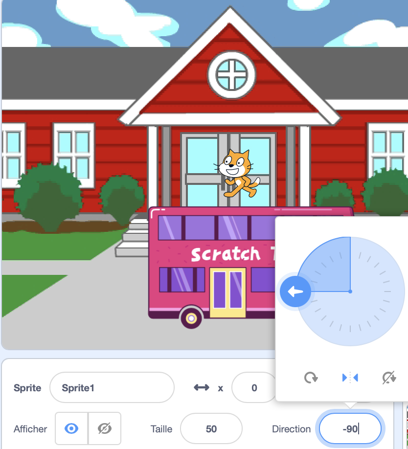

## Configuration

<div style="display: flex; flex-wrap: wrap">
<div style="flex-basis: 200px; flex-grow: 1; margin-right: 15px;">
As-tu une idée de ton animation ? 
  
Dans cette étape, tu ajouteras une toile de fond, un personnage principal et un objet intéressant. 
</div>
<div>  

</div>
</div>

--- task ---

Open the [surprise! animation starter project](https://scratch.mit.edu/projects/582222532/editor){:target="_blank"} and look at the range of sprites and backdrops that you can use. Spend some time thinking about your main character, interesting object, and backdrop.

--- /task ---

--- task ---

**Choisir :** Choisis un sprite pour être le personnage principal et un autre sprite pour être l'objet intéressant.


--- /task ---

Où veux-tu que ton animation se déroule ?

--- task ---

**Choisir :** Choisis un arrière-plan pour définir la scène.


--- /task ---

Où veux-tu que tes sprites démarrent ? Quelle taille veux-tu qu'ils soient ? Comment veux-tu qu'ils aient l'air?

--- task ---

Ajoute un `quand le drapeau vert est cliqué`bloc {:class="block3events"}, puis, en dessous, ajoute des blocs pour configurer tes sprites au début de ton animation.

N'oublie pas de mettre en place à la fois de ton **personnage principal** et ton **objet intéressant**.

--- collapse ---
---
title : Positionner tes sprites
---

Pour changer la position du **personnage principal** pour l'ensemble du projet, déplace le personnage principal à la position de ton choix sur la scène.

Pour changer la position du **personnage principal** pour une partie du projet, déplace le personnage principal à la position de ton choix sur la scène, puis ajoute un bloc `aller à x: y:`{:class="block3motion"} à ton code :

```blocks3
go to x: (0) y: (0) // add the sprite's position
```

Répète cette tâche pour l'**objet intéressant**.

--- /collapse ---

--- collapse ---
---
title: Redimensionner tes sprites
---

Pour modifier la taille d'un sprite pour l'ensemble du projet, modifie le nombre dans la propriété **Taille** dans le volet Sprite :



Pour modifier la taille d'un sprite pour une partie du projet, ajoute du code à `mettre à la taille sur`{:class="block3looks"} la taille de ton choix. Cette option est bonne si tu veux que ton sprite change de taille dans le projet.

```blocks3
set size to [100] % // <100 is smaller, >100 is bigger
```

--- /collapse ---

--- collapse ---
---
title: Régler les costumes de tes sprites
---

Pour changer le costume d'un sprite pour l'ensemble du projet, clique sur **Costumes** et sélectionne l'un des costumes disponibles :



Pour changer le costume d'un sprite pour une partie du projet, ajoute un `basculer sur le costume`{:class="block3looks"} à ton code et mets-le à jour pour afficher le costume de ton choix :

```blocks3
switch costume to [ v]  // update this for your chosen costume
```

Pour masquer un sprite au début du projet, ajoute un `cacher`{:class="block3looks"} à ton code :

```blocks3
hide 
```

--- /collapse ---

--- collapse ---
---
title: Définir la direction de tes sprites
---

Tes sprites peuvent être mal orientés lorsque tu les ajoutes à ton projet.

Pour changer la direction de sprite pour l'ensemble du projet, modifie le style de **Direction** et de **rotation** dans le volet Sprite :



Pour changer la direction d'un sprite pour une partie du projet, ajoute des blocs à ton code pour changer le `fixer le sens de rotation`{:class="block3motion"} et `direction`{:class="block3motion"} :

```blocks3
set rotation style [left-right v]
point in direction (-90) // turn to the left
```

--- /collapse ---

--- /task ---

--- task ---

Sauvegarde ton projet.

[[[generic-scratch3-saving]]]

--- /task ---

--- save ---
