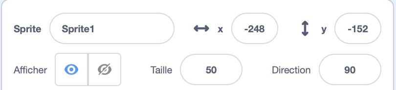
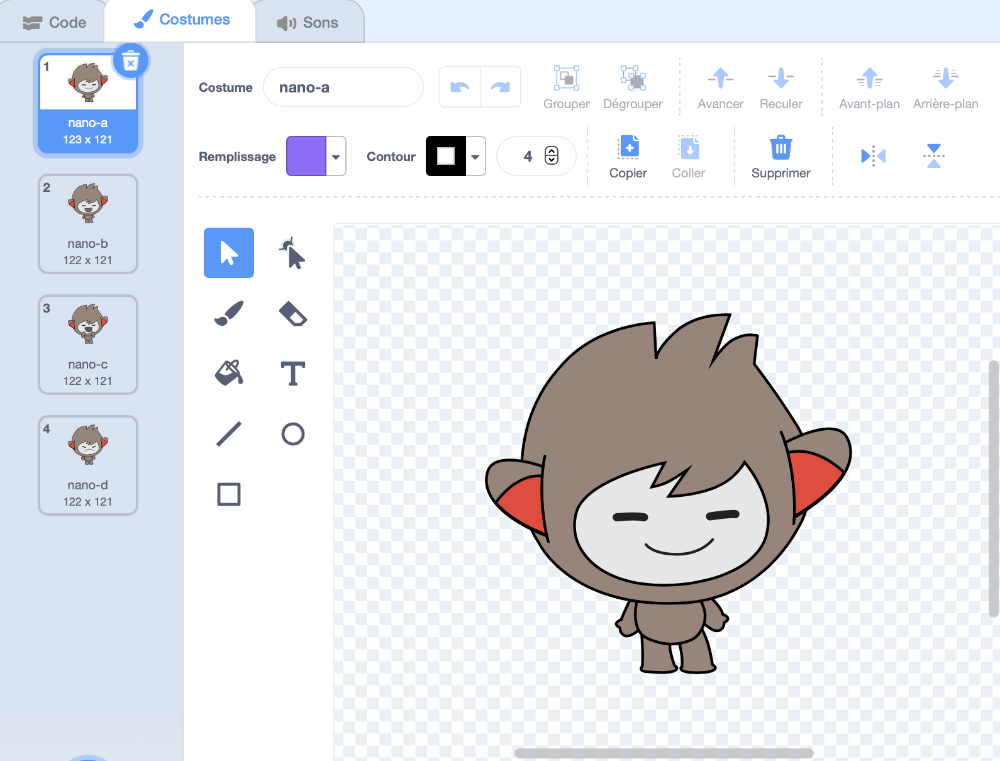
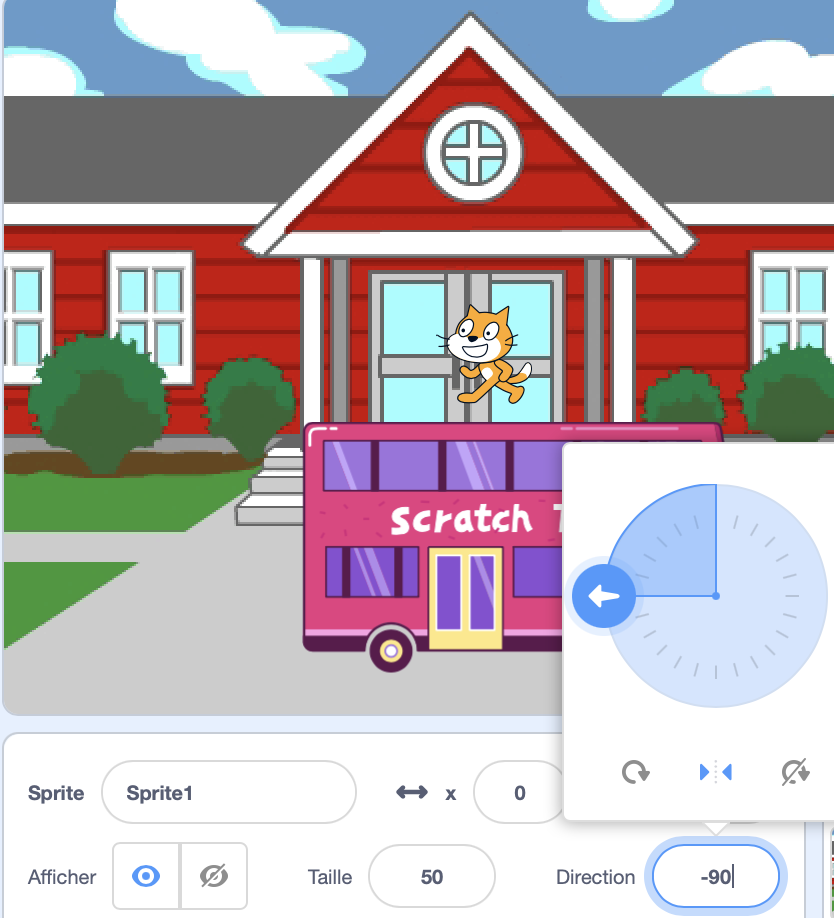

## Créer ta scène

As-tu une idée pour ton animation ?

Ajoute un arrière-plan 🖼️, un personnage principal 🐙👩‍🦼🦖, et un objet intéressant 🎂🎾🎁 de ton choix pour créer la **première partie** de ton animation.


<p style="border-left: solid; border-width:10px; border-color: #0faeb0; background-color: aliceblue; padding: 10px;">
  <span style="color: #0faeb0">**Animation**</span> crée un effet de mouvement en changeant rapidement les images. Les premiers animateurs sculptaient des images dans des blocs de bois et les utilisaient comme tampons. C'est beaucoup plus rapide d'utiliser Scratch pour coder ton animation !
</p>

### Ouvrir le projet de démarrage

--- task ---

Ouvre le [Surprise ! projet de démarrage d'animation](https://scratch.mit.edu/projects/582222532/editor){:target="_blank"}.

⏱️ Tu n'as pas beaucoup de temps ? Tu peux commencer à partir de l'un des [exemples](https://scratch.mit.edu/studios/29075822){:target="_blank"}.

--- /task ---

<p style="border-left: solid; border-width:10px; border-color: #0faeb0; background-color: aliceblue; padding: 10px;">
Il y a des personnes appelées <span style="color: #0faeb0">**concepteurs narratifs**</span> qui racontent des histoires pour des applications et des jeux vidéo. La narration numérique permet à chacun de partager ses histoires et ses imaginations créatives avec d'autres personnes.
</p>

### Concevoir ta scène

--- task ---

**Choisir :** un thème pour ton animation. Tu pourrais choisir :

+ 🐯 Animaux terrestres
+ 🐠 Animaux marins
+ 👽 Extraterrestres
+ 🌿 Nature
+ 🌈 Météo
+ 🌮 Nourriture
+ 🚀 Voyage
+ ⚾ Sport .... Ou autre chose

--- /task ---

--- task ---

**Choisir :** Choisis un sprite pour être le 🐙👩‍🦼🦖 **personnage principal**, un autre sprite pour être l' 🎂🎾🎁 **objet intéressant** et un 🖼️ **décor** pour planter le décor.


--- /task ---

### Préparer tes sprites

Où veux-tu que tes sprites démarrent ? Quelle taille veux-tu qu'ils soient ? À quoi veux-tu qu'ils ressemblent ?

--- task ---

Ajoute un bloc `quand le drapeau vert est cliqué`{:class="block3events"}, puis, en dessous, ajoute des blocs pour configurer tes sprites au début de ton animation.

**Astuce :** n'oublie pas de configurer à la fois ton 🐙👩‍🦼🦖 **personnage principal** et tes sprites 🎂🎾🎁 **objet intéressant**.

--- collapse ---
---
title: Position your sprites
---

Déplace le 🐙👩‍🦼🦖 **personnage principal** vers la position de ton choix sur la scène, puis ajoute un bloc `aller à x: y:`{:class="block3motion"} à ton code :

```blocks3
go to x: (0) y: (0) // add the sprite's position
```

Répète cette tâche pour l' 🎂🎾🎁 **objet intéressant**.

--- /collapse ---

--- collapse ---
---
title: Resize your sprites
---

Pour modifier la taille d'un sprite pour l'ensemble du projet, modifie le nombre dans la propriété **Taille** dans le panneau Sprite :



Pour modifier la taille d'un sprite pour une partie du projet, ajoute du code pour `mettre à la taille sur`{:class="block3looks"} la taille de ton choix. C'est une bonne option si tu veux que ton sprite change de taille dans le projet.

```blocks3
set size to [100] % // <100 is smaller, >100 is bigger
```

--- /collapse ---

--- collapse ---
---
title: Set the costumes of your sprites
---

Pour changer le costume d'un sprite pour l'ensemble du projet, clique sur **Costumes** et sélectionne l'un des costumes disponibles :



Pour changer le costume d'un sprite pour une partie du projet, ajoute un bloc `basculer sur le costume`{:class="block3looks"} à ton code et mets-le à jour pour afficher le costume de ton choix :

```blocks3
switch costume to [ v]  // update this for your chosen costume
```

Pour masquer un sprite au début du projet, ajoute un bloc `cacher`{:class="block3looks"} à ton code :

```blocks3
hide 
```

--- /collapse ---

--- collapse ---
---
title: Set the direction of your sprites
---

Tes sprites peuvent être mal orientés lorsque tu les ajoutes à ton projet.

Pour changer la direction de sprite pour l'ensemble du projet, modifie le style de **Direction** et de **Rotation** dans le panneau Sprite :



Pour changer la direction d'un sprite pour une partie du projet, ajoute des blocs à ton code pour changer `fixer le sens de rotation`{:class="block3motion"} et `direction`{:class="block3motion"} :

```blocks3
set rotation style [left-right v]
point in direction (-90) // turn to the left
```

--- /collapse ---

--- /task ---

--- task ---

Sauvegarde ton projet.

[[[generic-scratch3-saving]]]

--- /task ---
