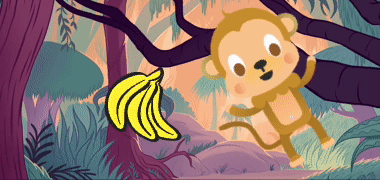

## Ajouter une surprise !

Maintenant, tu dois ajouter une surprise. Que peut-il arriver à l'objet ?
- Se transformera-t-il en un autre objet ?
- Est-ce qu'il va devenir un personnage ?
- Va-t-il disparaître et révéler un autre sprite ?

C'est toi qui décides ! Crée la **troisième partie** de ton animation.


<p style="border-left: solid; border-width:10px; border-color: #0faeb0; background-color: aliceblue; padding: 10px;">
As-tu écrit une histoire avec un rebondissement ou une surprise ? As-tu regardé une émission ou lu un livre dont la fin est imprévisible ? Tu peux utiliser les mêmes méthodes lorsque tu crées une histoire ou une animation numérique. 
</p>

### Quand la surprise va-t-elle arriver ?

--- task ---

Sélectionne le sprite 🎂🎾🎁 **objet intéressant**. Ajoute un script pour que la surprise commence quand tu le souhaites.

Tu dois choisir un délai qui convient à ton projet. Si tu as un personnage qui passe beaucoup de temps à être curieux, tu devras choisir un délai plus long.

```blocks3
when flag clicked
wait (5) seconds // changer le nombre pour créer ta temporisation
```

--- /task ---

### Maintenant, crée la surprise !

--- task ---

L'objet pourrait `jouer un son`{:class="block3sound"}, `basculer sur le costume`{:class="block3looks"}, `changer les effets graphiques`{:class="block3looks"}, ou `changer la taille`{:class="block3looks"}.

Tu pourrais ajouter un costume surprenant au sprite, puis le sprite pourrait `basculer sur le costume`{:class="block3looks"} pour le révéler.



[[[scratch3-add-costumes-to-a-sprite]]]

Tu peux donner l'impression que le sprite se transforme en un sprite différent. Pour ce faire, `cache`{:class="block3looks"} le sprite🎂🎾🎁 **objet intéressant** en même temps que tu `montres`{:class="block3looks"} un autre sprite.

--- collapse ---
---
title: Masquer et afficher les sprites
---

Le sprite🎂🎾🎁 **objet intéressant** :
```blocks3
when flag clicked
show
wait (5) seconds
hide
```

Le sprite🎷👻⚡**objet surprise** :
```blocks3
when flag clicked
hide
wait (5) seconds
show
```

**Astuce :** si tu 🎷👻⚡ **montres** un sprite `objet surprise`{:class="block3looks"}, tu devras le `cacher` `quand le drapeau vert est cliqué`{:class="block3events"}.

--- /collapse ---

--- /task ---

--- task ---

**Test :** Clique sur le drapeau vert. La surprise arrive-t-elle au bon moment ? L'animation se réinitialise-t-elle correctement ?

--- /task ---

--- task ---

**Déboguer :**

Si tu as besoin qu'un sprite soit devant ou derrière un autre sprite, tu peux utiliser des calques :

[[[scratch3-positioning-with-layers]]]

Si la surprise se produit au mauvais moment, tu peux y remédier :

--- collapse ---
---
title: La surprise commence au mauvais moment
---

Tu devras peut-être modifier la durée de certains ou de tous les blocs `attendre`{:class="block3control"}, ou ajouter plus de blocs `attendre`{:class="block3control"}, pour obtenir le bon timing.

--- /collapse ---

--- /task ---

