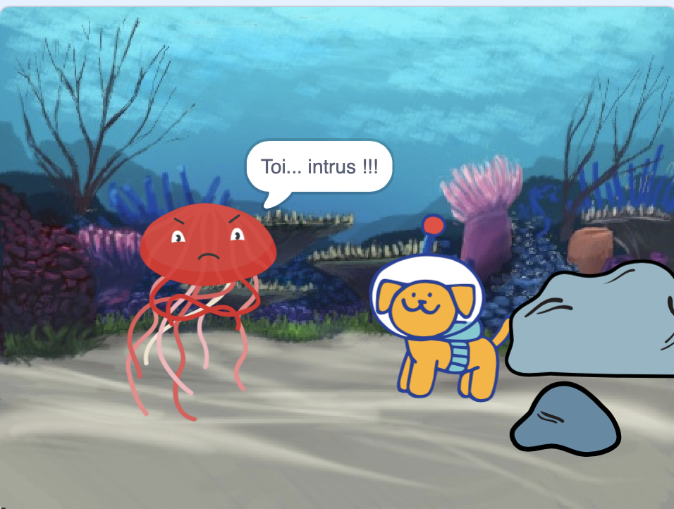

## Réaction

Maintenant, le personnage principal doit réagir à la surprise. Qu'est-ce qu'ils vont faire? 
- Quand vont-ils réagir ?
- Comment vont-ils s'émouvoir ? 
- Vont-ils dire quelque chose, faire un son, changer de costume ou bouger ? 

Tu décides!

### Quand le personnage réagira-t-il ?

--- task ---

Sélectionne le sprite **personnage**. Ajoute un script pour que la réaction démarre quand tu le souhaites.

[[[scratch3-time-delay]]]

--- /task ---

### Comment réagira le personnage ?

--- task ---

Choisis les actions qui ont du sens pour ton personnage et sa réaction.

[[[scratch3-change-costumes-to-show-mood]]]

[[[scratch3-graphic-effects]]]

[[[scratch3-text-to-speech]]]

[[[scratch3-animate-movement-costumes]]]

[[[scratch3-add-sound]]]

[[[scratch3-record-sound]]]

--- /task ---

--- task ---

**Test :** Clique sur le drapeau vert. Ton animation se déroule-t-elle comme tu le souhaites ? As-tu créé du suspense et une réaction dans ton histoire ? Est-ce que tout se réinitialise correctement lorsque tu cliques à nouveau sur le drapeau vert ?

--- /task ---

--- task ---

**Débogage :** Tu devras peut-être modifier la durée de certains ou de tous les blocs `quand le chronomètre`{:class="block3events"} et `attendre`{:class="block3control"}, ou ajouter plus de blocs `attendre`  {:class="block3control"}, pour obtenir le bon moment.

--- /task ---

--- save ---
